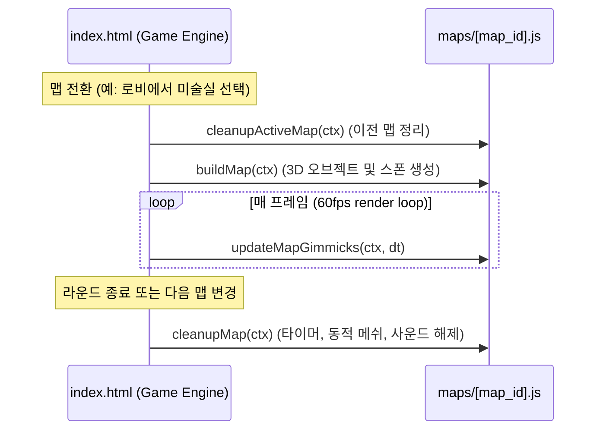

# 🏛️ 신규 맵 모듈화 아키텍처 및 상세 개발 명세서 (05_new_maps_specification.md)

- **문서 번호**: 05
- **문서 버전**: v1.2.0
- **작성일**: 2026-09-21
- **상태**: 맵 모듈 표준 규격 수립 및 1단계 불일치 교정 완료 (`확정·1단계 완료`)
- **안전 기준 커밋**: `34fe2a0` (배포본 무결성 보존)
- **관련 파일**: [`maps/README.md`](file:///C:/chatGPT_test/eraser_hideandseek/maps/README.md), [`maps/art_room.js`](file:///C:/chatGPT_test/eraser_hideandseek/maps/art_room.js)

---

## 1. 아키텍처 배경 및 의존성 주입(`ctx`) 패턴

### 1.1 배경 및 문제 해결
기존 배포 파일인 [index.html](file:///C:/chatGPT_test/eraser_hideandseek/index.html)은 약 5,800줄의 인라인 ES 모듈(`<script type="module">`)로 구성되어 있습니다.  
인라인 모듈 내부에서 정의된 헬퍼 함수(`addBox`, `addCyl`, `canvasTex`, `lambert` 등)와 컬렉션(`samplables`, `colliders`, `refillZones` 등)은 **모듈의 지역 스코프(Local Scope)**에 존재하므로, 외부 자바스크립트 파일에서 전역 변수로 직접 접근할 수 없습니다.

이를 해결하고 **기존 `index.html`을 건드리지 않는 완벽한 격리 개발**을 위해, 모든 맵 모듈은 필요한 3D 엔진 기능과 상태 컬렉션을 **`ctx` (Context) 객체로 주입받는 의존성 주입(Dependency Injection) 패턴**을 채택합니다.

### 1.2 `ctx` 컨텍스트 객체 스펙

`build[MapName](ctx)` 함수에 전달되는 `ctx` 인터페이스는 다음과 같습니다:

```typescript
interface MapBuildContext {
  THREE: typeof import("three");      // Three.js 코어 라이브러리
  mapRoot: THREE.Group;               // 맵 메쉬들이 추가될 3D 루트 그룹
  ROOM_W: number;                     // 맵 너비 (기본 120)
  ROOM_D: number;                     // 맵 깊이 (기본 90)
  WALL_H: number;                     // 기본 맵 벽 높이 (읽기 전용 참조)
  setWallHeight: (height: number) => void; // 벽 높이 설정 계약 함수 (ctx.WALL_H 직접 수정 금지)
  
  // 지오메트리 & 머티리얼 헬퍼
  addBox: (w: number, h: number, d: number, mat: THREE.Material, x: number, y: number, z: number, opt?: any) => THREE.Mesh;
  addCyl: (r: number, h: number, mat: THREE.Material, x: number, y: number, z: number, opt?: any) => THREE.Mesh;
  canvasTex: (w: number, h: number, drawFn: (ctx: CanvasRenderingContext2D, w: number, h: number) => void, rx?: number, ry?: number) => THREE.CanvasTexture;
  lambert: (opt: THREE.MeshLambertMaterialParameters) => THREE.MeshLambertMaterial;
  addAABBCollider: (x: number, y: number, z: number, sx: number, sy: number, sz: number) => void;
  buildRoomShell: (floorMat: THREE.Material, wallColor?: number, ceilingColor?: number, baseboardColor?: number) => void;

  // 게임 상태 컬렉션 (배열 참조)
  samplables: THREE.Mesh[];           // 스포이드 색 추출 가능한 메쉬 목록
  colliders: AABB[];                  // 물리 충돌체 목록
  refillZones: RefillZone[];          // 물감 리필 영역 목록 ({x, z, r, yMin, yMax, label})
  hiderSpawns: THREE.Vector3[];       // 지우개 요정 스폰 좌표 배열 (최소 16개)
  seekerSpawns: THREE.Vector3[];      // 연필 술래 스폰 좌표 배열 (최소 6개)
}
```

---

## 2. 맵 모듈 생명주기 (Map Lifecycle)

각 맵 파일은 일관된 생명주기 인터페이스를 제공하여 맵 로딩, 매 프레임 기믹 제어, 전환 시 리소스 정리를 완벽히 지원합니다.



---

## 3. 5종 신규 맵별 상세 구현 스펙

### 🎨 1. 미술실 (`maps/art_room.js`)
* **메타데이터**: `{ id: "art_room", name: "미술실", icon: "🎨" }`
* **천장 높이 (`setWallHeight`)**: `34` 호출 (`ctx.WALL_H` 직접 변조 금지)
* **바닥 텍스처**: 회백색 리놀륨 바닥 타일 위에 알록달록한 물감 방울이 튄 2D Canvas 절차적 텍스처.
* **핵심 가구 및 소품**:
  * **전면 (-Z)**: 대형 초록 칠판, 미술 대회 포스터, 교사용 시범대(대형 원형 팔레트 리필존: `label: "물감 팔레트"`).
  * **중앙 실습 구역**: 대형 원목 미술 테이블 4개, 4발 회전 나무 스툴(총 16개).
  * **테이블 상판 소품 (Y=4.2 ~ 5.5)**:
    - 수채화 12색 물감 팔레트 (`{ collide: false, sample: true }` - 비비드 원색 블록)
    - 3칸 투명 물통 (반투명 파란 유리 + 탁한 물)
    - 48색 크레파스 상자 및 색연필 통
    - 붓꽂이 원통
  * **좌측 (-X)**: **12단 미술 작품 건조대**
    - 스틸 프레임 양쪽 기둥과 상단 바에 개별 충돌체 부여.
    - 건조대 전체를 막는 통짜 AABB 충돌체를 배제하고, **정확히 12단의 와이어 선반 각각에 개별 충돌체(`collide: true`)를 적용**.
    - 플레이어가 선반을 계단처럼 차례차례 밟고 올라가 상단까지 파쿠르할 수 있는 수직 이동 동선 확보.
  * **우측 (+X)**: 이젤 4대 및 캔버스 화폭, 조소용 찰흙 덩어리 테이블.
  * **후면 (+Z)**: 청소 싱크대, 재료 수납장 2채 (색종이 묶음 위장).
* **스폰 규격**:
  * `hiderSpawns`: 테이블 밑, 건조대 통로, 이젤 뒤, 싱크대 옆 등 충돌체 바깥 안전 바닥 20개 지점 (`THREE.Vector3`).
  * `seekerSpawns`: 교탁 앞 중앙 통로 6개 지점 (`THREE.Vector3`).
* **특화 기믹 구현 현황**:
  * **바닥 물감 웅덩이 호흡 펄스 (구현 완료)**: 바닥 빨강/파랑/노랑 웅덩이의 투명도가 부드럽게 진동하는 시각 효과.
  * **물감 웅덩이 밟기 시 발자국 생성 (보류 기능)**:
    - 플레이어 위치 및 이동 상태(`G.pos`, `G.isMoving` 또는 멀티플레이어 동기화 위치)에 대한 컨텍스트 계약이 부재하므로, 해당 계약이 정립될 때까지 보류로 분류.
* **정리 (`cleanupArtRoom`)**:
  * 동적 생성 웅덩이 메쉬 및 머티리얼 메모리 해제, 내부 타이머 초기화.

---

### 🏃 2. 체육관 / 강당 (`maps/gymnasium.js`)
* **메타데이터**: `{ id: "gymnasium", name: "체육관", icon: "🏃" }`
* **천장 높이 (`setWallHeight`)**: `48` (시원한 고공 뷰)
* **바닥 텍스처**: 광택 있는 원목 마룻바닥 및 농구 코트 라인(삼점선, 센터 서클).
* **핵심 가구 및 소품**:
  * 농구 골대 2조 (상단 림 및 그물, 백보드), 벽면 늑목(사다리 파쿠르).
  * 단계별 뜀틀(3단, 5단) 및 두꺼운 파란색 안전 낙하 매트.
  * 철망 볼 카트(농구공, 배구공, 피구공 구형 지오메트리 다수).
  * 무대 단상 및 붉은색 벨벳 암막 커튼.
* **스폰 규격**:
  * `hiderSpawns`: 단상 아래, 늑목 사이, 골대 뒤, 관람석, 매트 너머 등 충돌체 바깥 안전 바닥 20개 지점 (`THREE.Vector3`).
  * `seekerSpawns`: 센터 서클 중앙 6개 지점 (`THREE.Vector3`).
* **특화 기믹 구현 현황**:
  * **구름판(뜀판) 시각 펄스 효과 (구현 완료)**: 주황색 뜀판 상판의 은은한 호흡 펄스 이펙트.
  * **구름판 밟기 시 슈퍼 점프 가속 (보류 기능)**:
    - **보류 사유**: 플레이어의 물리 속도(`G.vy` 또는 물리 가속 메서드)에 접근할 수 있는 컨텍스트 계약이 부재함. 엔진 내부 상태를 임의로 추측하거나 전역 변수를 침범하지 않기 위해 보류로 분류.
    - **향후 필요 계약 인터페이스**:
      ```typescript
      // 엔진 측에서 ctx로 주입되어야 할 계약
      interface PlayerBounceContract {
        onPlayerBounce?: (jumpVelocity: number) => void; // 플레이어 수직 속도 가속 콜백
        playerPositions?: Array<{ id: string, pos: THREE.Vector3, vy: number }>; // 플레이어 물리 상태
      }
      ```
* **정리 (`cleanupGymnasium`)**:
  * 뜀판 참조 배열 초기화 및 애니메이션 타이머 리셋.

---

### 🎹 3. 음악실 (`maps/music_room.js`)
* **메타데이터**: `{ id: "music_room", name: "음악실", icon: "🎹" }`
* **천장 높이 (`setWallHeight`)**: `35`
* **바닥 텍스처**: 차음재 카펫 바닥 및 3단 계단식 합창석 마루.
* **핵심 가구 및 소품**:
  * 전면 그랜드 피아노 (흑백 건반 세밀 묘사, 보면대).
  * 알록달록 무지개 8색 실로폰/글로켄슈필, 장구 및 북 국악기 코너.
  * 계단식 좌석마다 촘촘히 늘어선 검은색 삼각 악보 보면대 숲.
* **특화 기믹 상태**:
  * **소리 나는 피아노 계단**: 사용자 인터랙션 및 오디오 컨텍스트 계약 후 구현.

---

### 🩹 4. 보건실 (`maps/health_office.js`)
* **메타데이터**: `{ id: "health_office", name: "보건실", icon: "🩹" }`
* **천장 높이 (`setWallHeight`)**: `32`
* **바닥 텍스처**: 깔끔한 연민트색 항균 비닐 장판 타일.
* **핵심 가구 및 소품**:
  * 하얀 침대 3조 및 반투명 주름 커튼(완전 밀폐 지점 방지).
  * 구급약 보관함, 붕대/거즈 더미, 유리 선반 약병들.
  * 신장/체중 측정기, 전면 벽 시력검사표 차트.
* **특화 기믹 상태**:
  * **안식처 버프**: 삑삑이 타이머 우회 엔진 계약 전까지 보류.

---

### 🧸 5. 돌봄교실 / 늘봄교실 (`maps/care_room.js`)
* **메타데이터**: `{ id: "care_room", name: "돌봄교실", icon: "🧸" }`
* **천장 높이 (`setWallHeight`)**: `33`
* **바닥 텍스처**: 4색(노랑, 분홍, 하늘, 연두) EVA 사각 퍼즐 조립 매트.
* **핵심 가구 및 소품**:
  * 낮은 원형 좌식 테이블, 낮은 장난감 정리함, 보드게임 진열장.
  * 대형 레고 블록 바구니, 봉제 동물 인형 무더기, 인디언 미니 텐트.
* **특화 기믹 상태**:
  * **순환 주행 미니 기차**: cleanup에서 완벽히 해제되는 타이머/메쉬 동기화 구조 적용 예정.

---

## 4. 향후 `index.html` 정식 통합 가이드 (실제 MAPS 객체 구조 기준)

> ⚠️ **주의**: 아래 코드는 7단계에서 Codex 승인 후 실제 적용할 통합 설계안이며, **현재 1~6단계에서는 배포본 `index.html`을 절대 수정하지 않습니다.**

### 4.1 실제 `MAPS` 객체 구조에 맞춘 등록 방식
실제 [index.html](file:///C:/chatGPT_test/eraser_hideandseek/index.html)에서 `MAPS`는 배열이 아닌 **키-값 객체(Object)**입니다.

```javascript
// 1. 최상단 모듈 Import 추가
import { ART_ROOM_MAP, buildArtRoom, updateArtRoomGimmicks, cleanupArtRoom } from "./maps/art_room.js";

// 2. 실제 index.html의 MAPS 객체에 신규 항목 등록
const MAPS = {
  classroom: { id: "classroom", name: "교실", icon: "🏫", type: "canvas", build: buildMap },
  science:   { id: "science",   name: "과학실", icon: "🧪", type: "canvas", build: buildScienceLab },
  cafeteria: { id: "cafeteria", name: "급식실", icon: "🍱", type: "canvas", build: buildCafeteria },
  library:   { id: "library",   name: "도서관", icon: "📚", type: "canvas", build: buildLibrary },
  // 신규 모듈 맵 등록 (type: "module")
  art_room:  { id: "art_room",  name: "미술실", icon: "🎨", type: "module", build: buildArtRoom, update: updateArtRoomGimmicks, cleanup: cleanupArtRoom }
};
```

### 4.2 `mapIsReady(id)` 수정 예시 (`type === "module"` 허용)
기존 `mapIsReady(id)`는 `type === "canvas"` 또는 `glbBase64`만 허용하므로, `module` 타입을 유효한 맵으로 판정하도록 조건 분기를 보완해야 합니다:

```javascript
// 기존 코드:
// function mapIsReady(id){ const m=MAPS[id]; if(!m)return false; return m.type==="canvas"?true:!!(m.glbBase64&&m.glbBase64.length>100); }

// module 타입 허용 수정안:
function mapIsReady(id) {
  const m = MAPS[id];
  if (!m) return false;
  if (m.type === "canvas" || m.type === "module") return true;
  return !!(m.glbBase64 && m.glbBase64.length > 100);
}
```

### 4.3 `updateMapGimmicks(dt)` 연결 예시 (현재 활성 맵 기믹 호출)
매 프레임(60fps) 호출되는 `updateMapGimmicks(dt)` 내에서, 현재 활성 맵이 `type === "module"`이고 `update` 함수를 가지고 있다면 컨텍스트와 `dt`를 전달하여 기믹을 갱신하도록 연결합니다:

```javascript
// 기존 코드:
// function updateMapGimmicks(dt){
//   if(currentMapId==="science") updateScienceLabGimmick(dt); else sciCleanup();
//   if(currentMapId==="cafeteria"){ updateSlipZones(dt); updateConveyor(dt); updateSteam(dt); } else steamCleanup();
//   if(currentMapId!=="library") cartCleanup(); else updateBookCarts(dt);
// }

// 신규 모듈 맵 기믹 갱신 분기 추가안:
function updateMapGimmicks(dt) {
  if (currentMapId === "science") updateScienceLabGimmick(dt); else sciCleanup();
  if (currentMapId === "cafeteria") { updateSlipZones(dt); updateConveyor(dt); updateSteam(dt); } else steamCleanup();
  if (currentMapId !== "library") cartCleanup(); else updateBookCarts(dt);

  // 현재 활성화된 모듈 맵의 매 프레임 기믹 갱신
  const cur = MAPS[currentMapId];
  if (cur && cur.type === "module" && typeof cur.update === "function") {
    cur.update(makeBuildContext(), dt);
  }
}
```

### 4.4 `buildActiveMap(mapId)` 및 컨텍스트 생성 브리지 예시
실제 `buildActiveMap(mapId)` 함수는 `mapId` 문자열을 인자로 받아 동작하므로, 이전 맵 정리(`cleanup`)와 모듈 맵 실행(`build(ctx)`)을 다음과 같이 연결합니다:

```javascript
async function buildActiveMap(mapId) {
  const def = MAPS[mapId] && mapIsReady(mapId) ? MAPS[mapId] : MAPS.classroom;
  
  // 이전 맵이 모듈 맵인 경우 cleanup 호출하여 리소스 정리
  if (currentMapId && MAPS[currentMapId] && typeof MAPS[currentMapId].cleanup === "function") {
    MAPS[currentMapId].cleanup(makeBuildContext());
  }

  clearMap();

  if (def.type === "module") {
    // 신규 모듈 맵: ctx 주입 실행
    def.build(makeBuildContext());
  } else if (def.type === "canvas") {
    // 기존 레거시 맵: 인라인 직접 실행
    def.build();
  } else {
    // GLB 맵 로딩
    await loadGLBMap(def);
  }

  currentMapId = def.id;
}

// 헬퍼: 컨텍스트 생성 브리지 함수
function makeBuildContext() {
  return {
    THREE, mapRoot, ROOM_W, ROOM_D, WALL_H,
    setWallHeight: (h) => { WALL_H = h; },
    addBox, addCyl, canvasTex, lambert, addAABBCollider,
    samplables, colliders, refillZones, hiderSpawns, seekerSpawns, buildRoomShell
  };
}
```

### 4.5 정식 통합 시 실제 필요한 변경 항목 요약
추후 7단계에서 배포본 [index.html](file:///C:/chatGPT_test/eraser_hideandseek/index.html)에 신규 맵을 정식 통합할 때 실제로 변경되어야 하는 항목은 다음과 같습니다:

1. **상단 모듈 Import문 추가**: 맵별 export 객체 및 함수 임포트
2. **`MAPS` 객체 항목 추가**: `type: "module"` 속성과 함께 맵 메타데이터 및 빌드/기믹/정리 함수 바인딩
3. **`mapIsReady(id)` 조건 확장**: `m.type === "module"` 판정 추가
4. **`updateMapGimmicks(dt)` 후크 추가**: 활성 모듈 맵의 `cur.update(ctx, dt)` 호출 라인 삽입
5. **`buildActiveMap(mapId)` 분기 보강**: 이전 맵 `cleanup` 호출 및 `def.type === "module"` 분기에서 `makeBuildContext()`를 주입하여 `def.build(ctx)` 호출
6. **`makeBuildContext()` 브리지 함수 신설**: 엔진 내부 스코프의 전역 변수·컬렉션을 `ctx` 형태로 묶어주는 헬퍼 추가
