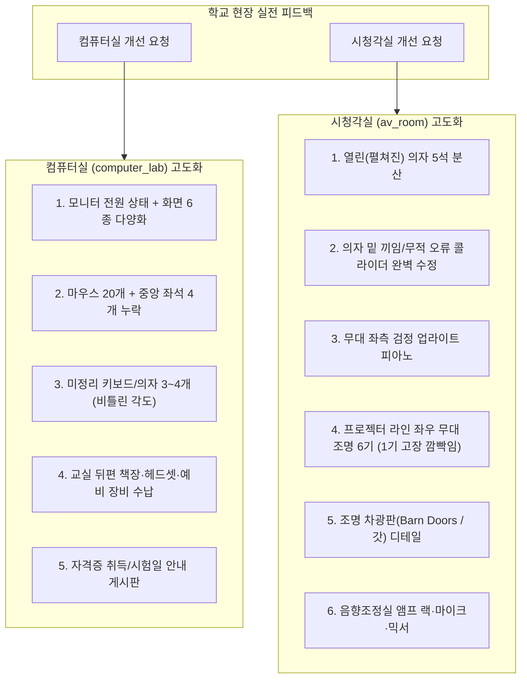

# 🎬 시청각실 및 🖥️ 컴퓨터실 2차 고도화 명세서 (현장 실전 피드백)

- **문서 번호**: `docs/21_av_room_and_computer_lab_enhancement_spec.md`
- **작성일**: 2026-09-29
- **작성자**: Lead Scientist & Technical Owner
- **상태**: 사용자 현장 피드백 반영 완료 및 상세 구현 규격 수립 (`Ready for Implementation`)
- **대상 모듈**:
  - `maps/av_room.js` (시청각실)
  - `maps/computer_lab.js` (컴퓨터실)
- **상위 연계 문서**:
  - [`docs/11_additional_map_ideas_and_level_design.md`](./11_additional_map_ideas_and_level_design.md)
  - [`docs/20_followup_maps_completion_report_2026-09-28.md`](./20_followup_maps_completion_report_2026-09-28.md)
  - [`interim_reports/03_new_map_ideas_and_level_design_spec.md`](../interim_reports/03_new_map_ideas_and_level_design_spec.md)

---

## 1. 개요 및 배경

2026년 9월 28일 신규 맵 3종(`av_room`, `computer_lab`, `library_elem`)의 1차 정식 배포 통합(1~6단계 PASS) 이후, 실제 학교 현장 수업 피드백 및 사용자 관찰을 통해 **현실 학교 공간의 디테일 고증**, **은신·수색 밸런스 개선**, **물리 충돌 오류 해결**을 위한 2차 추가 요구사항이 도출되었습니다.

본 문서는 사용자가 요청한 컴퓨터실 및 시청각실 개선 항목을 3D 그래픽, 수치 좌표, Three.js 지오메트리 규격 및 검증 기준에 맞추어 명세화합니다. 2026-09-29 추가 피드백(화면 전원 상태, 마우스 일부 누락, 후방 수납/자격증 게시물, 시청각실 음향·조명 장비)을 포함합니다.

---

## 2. 🖥️ 컴퓨터실 (`computer_lab`) 추가 및 고도화 명세

### 2.1 [요구 1] 모니터 화면 6종 다양화
- **기획 의도**: 기존 단일/단조로운 모니터 화면을 실제 컴퓨터실 수업 환경처럼 다채롭게 구성하여 시각적 몰입감을 높이고, 화면 발광 색상에 따른 은신/수색 명암 대비를 형성합니다.
- **상세 규격**:
  - 모니터 전원 상태는 **켜짐 18대 + 절전 3대 + 꺼짐 3대 = 24대**로 구분한다. 켜진 화면은 화면 테두리와 분명히 구별되는 밝은 UI와 자체 발광으로 실제 켜진 것이 한눈에 보여야 한다.
  - 켜진 18대에 `CanvasTexture` 화면 6종을 각 3대씩 배정한다. 절전 3대는 어두운 절전 화면, 꺼짐 3대는 발광 없는 검은 화면으로 표현한다.
  1. **코딩 에디터 화면 (3대)**: 다크 배경(`#1e1e1e`) + 형광 초록/하늘색/주황색 코드 텍스트 라인.
  2. **한글/문서 작성 화면 (3대)**: 화이트 배경(`#f8f9fa`) + 회색 텍스트 단락 + 파란색 툴바. (강한 역광 발생 지점)
  3. **그림판/아트 화면 (3대)**: 캔버스 바탕에 원색(빨강, 노랑, 파랑) 브러시 낙서 및 팔레트 UI.
  4. **웹 브라우저/포털 화면 (3대)**: 상단 녹색/청색 검색창 바 + 카드 뉴스 형태의 콘텐츠 블록.
  5. **스크래치/블록 코딩 화면 (3대)**: 주황/노랑/파랑 블록들이 조립된 블록 코딩 작업창.
  6. **바탕화면 및 위젯 (3대)**: 청록/하늘색 그라데이션 배경 + 격자형 노란색/흰색 앱 아이콘들.
- **기술적 규칙**:
  - `CanvasTexture`는 6종 텍스처 인스턴스를 사전 생성하여 켜진 18개 모니터가 캐시를 공유(`clone` 또는 동일 텍스처 참조). 절전/꺼짐 6대는 별도 상태를 사용한다.
  - 자체 발광(`emissive: new THREE.Color(...)`, `emissiveIntensity: 0.2~0.35`)을 활용해 외부 조명 부하 없이 선명한 화면 연출.
  - `cleanupComputerLab()` 시 생성된 6개 CanvasTexture와 재질을 반드시 `dispose()`하여 메모리 누수 방지.

### 2.2 [요구 2] 책상 위 마우스 오브젝트 배치 (지우개 착시 유도)
- **기획 의도**: 지우개 요정의 크기(약 1.2×0.7×0.5)와 유사한 검정/차콜 색상의 마우스를 책상 위 마우스패드 위에 배치하여, 술래(연필)가 모니터 책상을 수색할 때 마우스와 검정/어두운색으로 위장한 지우개를 혼동하도록 심리전을 유도합니다.
- **상세 규격**:
  - 수량: 총 20개. 중앙 통로에 가까운 자리 중 `Row0 Col2`, `Row1 Col3`, `Row2 Col2`, `Row3 Col3`의 4대에는 마우스를 두지 않아 정리되지 않은 현실감을 준다. 행/열은 `computer_lab.js`의 0-based 인덱스(4행×6석) 기준이다.
  - 크기: 기존 지우개 요정(약 `1.2 × 0.7 × 0.5`)과 비슷한 외곽 크기. 마우스는 길이(Z) 약 1.1~1.2, 너비(X) 약 0.7, 높이 약 0.38~0.5 유닛으로 한다.
  - 디테일: 중앙 휠 홈(회색 라인) 및 좌우 버튼 분할선.
  - 속성: `collide: false, sample: true` (이동을 방해하지 않으며 지우개가 마우스 색상을 스포이드로 찍어 완벽 동기화 가능).
  - 색상: 매트 블랙/다크 슬레이트 (`#1a1a1a` ~ `#2b2d42`).

### 2.3 [요구 3] 정리가 안 된 키보드 및 의자 3~4개 연출
- **기획 의도**: 모든 좌석이 자로 잰 듯 완벽히 정렬된 인위성을 탈피하고, 쉬는 시간 직후의 자연스러운 교실 분위기를 연출함과 동시에 지우개가 비뚤어진 틈새에 비스듬히 몸을 숨길 수 있는 유기적인 은신처를 제공합니다.
- **상세 규격**:
  - **비뚤어진 키보드 (4석)**:
    - 대상 좌석: 예) 좌측 2행 1열, 좌측 4행 3열, 우측 1행 2열, 우측 3행 1열.
    - 변형: 기본 Y축 회전 0도에서 약 15~25도 삐뚤게 회전시키고, 마우스패드 방향으로 0.3~0.5 유닛 비스듬히 밀린 배치.
  - **정리가 안 된 회전 바퀴의자 (4석)**:
    - 대상 좌석: 예) 좌측 1행 3열, 좌측 3행 2열, 우측 2행 3열, 우측 4행 1열.
    - 변형:
      1. 책상 하부에서 뒤쪽(복도/통로 방향)으로 0.8~1.4 유닛 빠져나옴 (`z += 1.0~1.4`).
      2. 의자 바디가 좌/우로 20~45도 회전 (`rotation.y = ±0.35~0.78 rad`).
    - 충돌체: 의자가 뒤로 나온 만큼 해당 좌석의 의자 충돌체 AABB 좌표도 정확히 동기화 보정하여 플레이어 끼임 방지.

### 2.4 [요구 4] 교실 뒷편 책장 및 헤드셋 보관함 (Headset Storage Bin)
- **기획 의도**: 컴퓨터실 후방 복도(Z in [36, 44])의 넓은 여백을 채우고, 학교 컴퓨터실에 필수적으로 비치되어 있는 멀티미디어 어학용 헤드셋 수납함과 전산 교재 책장을 배치하여 후방 스폰 및 수색의 전략성을 강화합니다.
- **상세 규격**:
  - **후방 전산 책장 (Bookcase)**:
    - 위치: 교실 후방 좌측 벽면 부근 (`x in [-42, -26]`, `z in [38, 42]`, `y = 0~7.5`).
    - 크기: 너비 14, 깊이 2.8, 높이 7.5 유닛 (3단 수납장).
    - 수납물: 두꺼운 컴퓨터 교재, 코딩 교과서, 소프트웨어 패키지 박스 (스포이드 가능).
    - 충돌체: 책장 외곽 AABB 등록.
  - **헤드셋 모음 상자 (Headset Storage Bins)**:
    - 위치: 교실 후방 우측 부근 (`x in [26, 40]`, `z in [38, 42]`, `y in [0, 4.0]`).
    - 구조: 헤드셋과 예비 주변기기를 구획별로 정리한 이동식 다단 보관장/카트 (밝은 그레이/아이보리 프레임). 추가 품목이 실제로 수납되도록 선반/AABB를 조정하고 기존 스폰 및 통로를 침범하지 않는다.
    - 수납물: 헤드셋 정확히 10개(반원형 헤드밴드 + 원형 이어패드), 예비 키보드 2개, 예비 마우스 4개를 우선 배치한다. 케이블 타이, LAN 케이블 코일, USB 허브 등 소형 수업/정비 도구도 2~4개 구분해 추가한다.
    - 은신 기믹: 헤드셋 이어패드 사이 좁은 틈새에 지우개가 쏙 들어가거나 헤드셋 블랙 컬러로 위장 가능.
  - **자격증 안내 게시판**:
    - 후방 벽면 또는 책장 인접 벽에 작은 게시판을 추가해 컴퓨터실의 학습 용도를 강화한다.
    - 예시 문구: “컴퓨터 자격 인증 취득 축하 — 학생 8명” 및 “다음 모의 자격증 시험일: 2026년 10월 24일(토)”. 게임 배경용 가상 안내문이며 실명·개인 식별 정보는 넣지 않는다.
    - 게시판은 벽/가구에 자연스럽게 붙이고, 문구가 실제 플레이 화면에서 읽히도록 CanvasTexture 등으로 렌더링한다. 스폰·플레이 동선과 겹치는 충돌체를 새로 만들지 않는다. 전용 텍스처를 만들면 `cleanupComputerLab()`에서 dispose한다.

---

## 3. 🎬 시청각실 (`av_room`) 추가 및 고도화 명세

### 3.1 [요구 1] 열려 있는(펼쳐진) 의자 5석 분산 배치
- **기획 의도**: 시청각실의 60석 접이식 좌석 중 학생이 앉았다가 일어난 뒤 좌판이 내려와 있는 상태(펼쳐진 의자)를 5석 구현하여 단조로움을 없애고, 펼쳐진 좌판 쿠션 위에 올라타거나 방석 색상(`#9e2a2b`)으로 완벽히 위장하는 고지대 은신 명당을 제공합니다.
- **상세 규격**:
  - 수량: 60석 중 5석 (각 계단 단차별로 1석씩 고르게 분산).
    - 예시 좌석: 1단 Row0 Col2, 2단 Row1 Col7, 3단 Row2 Col3, 4단 Row3 Col8, 5단 Row4 Col1.
  - 모델링 변경:
    - 일반 좌석(접힌 상태): 좌판 쿠션이 수직(Z축 기준 약 75~85도 직립)으로 세워져 등받이에 밀착.
    - 펼쳐진 좌석(열린 상태): 좌판 쿠션이 수평(`rotation.x = 0`, 바닥에 평행한 90도 각도)으로 내려와 있어 사람이 앉을 수 있는 방석 면적이 형성됨.
  - 충돌체 및 파쿠르:
    - 펼쳐진 좌판 상단(`y = tier_y + 1.8`)에 지우개가 올라설 수 있는 수평 충돌 판정 지원 (`sample: true`).

### 3.2 [요구 2] 의자 밑으로 들어가는 오류(클리핑/무적 버그) 완벽 수정
- **문제 원인 분석**:
  - 시청각실은 계단식 바닥 단차(Tier 1~6, 단차 높이 1.5씩 상승)와 각 좌석의 철제 프레임 다리가 복합 결합되어 있음.
  - 지우개 플레이어의 바운딩 크기(약 0.8)가 의자 하부 틈새와 계단 수직 벽면 사이 빈 공간으로 진입하면서, 플레이어 위치가 계단 바닥 슬래브 내부로 파고들거나 술래의 레이캐스트 콕 찍기 광선(`judgeRaycast`)이 의자 메쉬에 가려져 피격되지 않는 '무적 은신 버그' 발생.
- **해결 방안 (수정 조치 규격)**:
  1. **의자 하부 베이스 프레임 밀폐 충돌체 보강**:
     - 의자 60석의 각 행(Row)별로 좌석 하단(바닥면부터 좌판 하단 y=1.2까지)에 관통 방지용 차단 충돌체(Base Blocker AABB)를 정확한 높이로 설정.
     - `min.y = tier_floor_y`, `max.y = tier_floor_y + 1.4`로 설정하여 의자 다리 틈새로 파고드는 비정상 진입을 원천 차단.
  2. **계단 단차 수직면(Riser) 충돌체 빈틈 0.0 유닛 봉쇄**:
     - 계단 각 단의 전면 수직벽 충돌체와 의자 후면 충돌체 사이의 미세 갭(Gap)을 완전히 제거하여 단차 틈새 끼임 방지.

### 3.3 [요구 3] 무대 좌측 검정 업라이트 피아노 설치 (실제 학교 고증)
- **기획 의도**: 실제 사용자 학교의 시청각실 무대 좌측에 배치된 검정 업라이트 피아노를 그대로 재현하여 현실감을 극대화하고, 무대 위 피아노 뒤편과 건반 위를 새로운 은신 명당으로 활용합니다.
- **상세 규격**:
  - **위치**: 무대 상판 위 좌측 전면 (`x in [-28, -20]`, `z in [-36, -28]`, `y = 2.2` 무대 바닥 위 접지).
  - **크기**: 너비 7.0, 깊이 3.2, 높이 5.8 유닛 (클래식 업라이트 피아노 규격).
  - **세부 구성 부품**:
    1. **피아노 바디 (Black Body)**: 칠흑색 유광 피아노 도장 (`#111116`, `roughness: 0.2`, `metalness: 0.1`).
    2. **건반부 (Keybed & Cover)**: 흑백 건반 텍스처(흰 건반 위에 검은 건반 2-3 배열 패턴), 건반 뚜껑.
    3. **상단 보면대 (Music Stand)**: 보면대와 악보 오브젝트.
    4. **하부 페달부 (Pedals)**: 황동색 페달 3개 (`#d4af37`).
    5. **피아노 의자 (Piano Bench)**: 피아노 앞쪽 사각 가죽 쿠션 의자 (`y = 2.2 + 2.0`).
  - **은신 및 스포이드 포인트**:
    - 피아노 본체와 무대 벽면 사이의 좁은 틈새 은신.
    - 건반 뚜껑 위 및 피아노 의자 아래 은신.
    - 칠흑색 유광 피아노 도장 및 악보 화이트 스포이드 지원.
  - **충돌체**: 피아노 본체 AABB (`x: [-28, -20]`, `y: [2.2, 8.0]`, `z: [-36, -28]`) 등록.

### 3.4 [요구 4] 프로젝터 라인 좌우 무대 조명 6기 (3기씩) & 1기 고장 연출
- **기획 의도**: 시청각실 천장 중앙 프로젝터와 동일한 Z 라인에 좌우 조명 트러스 바텐을 설치하고, 무대를 향해 6개의 집중 조명을 비추어 극장 무대의 조명 연출을 완성합니다. 6개 중 1개는 불규칙하게 깜빡이거나 꺼진 고장 연출을 더해 현장감과 재미를 부여합니다.
- **상세 규격**:
  - **설치 위치**: 천장 프로젝터(`z = 5`, `y = 24`)와 동일한 Z축 깊이(`z in [4, 6]`), 천장 트러스 바텐(`y = 25~26`).
    - 좌측 조명 3기: `x = -36, -26, -16` (간격 10 유닛).
    - 우측 조명 3기: `x = 16, 26, 36` (간격 10 유닛).
  - **조명 지향각 (Targeting)**:
    - 6기 모두 무대 중앙 및 무대 전면(`x in [-25, 25], y = 2.2, z in [-35, -25]`)을 비스듬히 하향 투사.
  - **조명 빔 (Spotlight Cones)**:
    - 반투명 원뿔형 지오메트리 (`ConeGeometry`, `opacity: 0.18~0.25`, 블렌딩 모드 적용).
    - 은은한 웜화이트/골드 톤 조명광 (`#fff8e7` ~ `#ffeaa7`).
  - **고장 조명 연출 (1기 Flicker / Broken Effect)**:
    - 대상: 좌측 끝 1번 조명 (`x = -36`).
    - 연출 방식: `updateAvRoomGimmicks(ctx, dt)`에서 `Math.sin(time * 12.0) + noise`를 통해 불규칙하게 0.1초 단위로 깜빡이거나 꺼지는 전구 고장 효과 구현.
    - 고장 조명 아래는 간헐적으로 어두워져 지우개가 술래의 시야를 피하는 은신 포인트로 작용.

### 3.5 [요구 5] 조명 앞 차광판 부품 (반도어 Barn Doors / 갓) 제작
- **기획 의도**: 무대 전문 스포트라이트(Stage Fresnel/PAR Spotlight)의 상징인 4방향 힌지 차광판(Barn Doors)을 조명 렌즈 전면에 장착하여, 실제 무대 조명 장비다운 정밀한 하드웨어 디테일을 표현합니다.
- **상세 규격**:
  - **조명 하우징**: 원통형 블랙 스틸 캔 (`CylinderGeometry`, 직경 1.6, 길이 2.4).
  - **반도어 (Barn Doors) 4방향 플랩**:
    - 조명 원통 개구부 테두리에 상, 하, 좌, 우 4개의 사각 금속 차광판 날개 부착.
    - 각도: 바깥쪽으로 약 25~35도 살짝 벌어진 형태(`hinge flap`).
    - 색상: 매트 블랙 내열 스틸 (`#181818`, `roughness: 0.8`).
  - 성능 최적화: 조명 6기 전체의 반도어 날개 메쉬는 지오메트리 인스턴싱 또는 결합(`BufferGeometryUtils.mergeGeometries`)을 활용하여 드로우콜 증가를 최소화.

### 3.6 [추가 요구] 음향조정실 앰프·마이크·믹서 장비
- 기존 음향조정실/리필존(`x≈44, z≈33`)을 유지하고, 그 오른쪽 한쪽에 별도 오디오 랙을 배치한다.
- 랙에는 파워 앰프, 무선 마이크 수신기, 케이블/패치 패널을 구분 가능한 전면부로 표현한다. 권장 랙 AABB는 `min [50.5, 7.5, 31]`, `max [54.5, 13, 35]` (중심 `[52.5, 10.25, 33]`)이며 실제 메쉬 외곽에 맞춰 조정한다.
- 데스크 위 믹서는 기존 두 모니터와 혼동되지 않게 별도 콘솔로 모델링하고, 페이더·노브·채널 표시를 표현한다.
- 핸드 마이크 2개와 마이크 스탠드 1개 및 감긴 케이블을 추가한다. 기존 리필 기능을 가리거나 신규 스폰과 XZ 충돌하지 않게 한다.
- 랙 외곽 AABB는 기존 데스크 AABB와 겹치지 않고 방 경계 안에 있어야 한다. 작은 세부 메쉬는 필요하지 않으면 비충돌 장식으로 두며, 전용 리소스는 맵 정리 시 해제한다.

---

## 4. 모듈별 검증 기준 및 회귀 방지 체크리스트

| 대상 모듈 | 항목 | 검증 기준 및 회귀 방지책 |
| :--- | :--- | :--- |
| `computer_lab.js` | 모니터 전원 상태 | 켜짐 18 + 절전 3 + 꺼짐 3 및 켜진 18대 화면 6종 각 3대, 육안으로 상태 구별 |
| `computer_lab.js` | 마우스 20개 | 지정한 중앙 인접 좌석 4개 누락, 크기·위치, `collide: false`, `sample: true` 확인 |
| `computer_lab.js` | 삐뚤어진 의자/키보드 | 3~4개 좌석의 의자 AABB 충돌체 동기화 이동 확인 (충돌체 관통 버그 0건) |
| `computer_lab.js` | 후방 수납/게시판 | 헤드셋 10·예비 키보드 2·마우스 4·소형 도구, 게시판 문구/위치, 스폰과 AABB 겹침 0건 |
| `av_room.js` | 펼쳐진 의자 5석 | 5개 좌석의 좌판 수평 각도 및 착석면 충돌체 유효성 확인 |
| `av_room.js` | 의자 밑 끼임 수정 | 의자 하부 베이스 프레임 블로커 적용으로 바닥 밑 파고들기 원천 차단 확인 |
| `av_room.js` | 업라이트 피아노 | 무대 좌측(`x: [-28, -20], z: [-36, -28]`) 접지 및 무대 위 스폰과의 충돌 0건 확인 |
| `av_room.js` | 천장 조명 6기 & 반도어 | 프로젝터 Z라인(Z≈5) 좌우 3기 정렬, 반도어 날개 4방향 모델링 및 1기 깜빡임 기믹 확인 |
| `av_room.js` | 음향 장비 | 앰프 랙·수신기·믹서·마이크 2개·스탠드 존재, AABB/스폰/리필존/동선 확인 |
| 공통 검증 | 자동화 검사 | `node scripts/check_followup_maps.mjs` 29건 전수 무결성 통과 유지 |

---

## 5. 결론 및 향후 계획

본 명세서는 사용자의 요청 사항을 빠짐없이 수렴하여 향후 구현 작업 시 지침서로 활용될 수 있도록 작성되었습니다.
- **다음 단계**: 사용자의 추가 승인 및 구현 지시에 따라 `maps/av_room.js` 및 `maps/computer_lab.js` 소스 코드에 해당 기능들을 단계별로 적용하고 자동화 테스트를 수행합니다.
