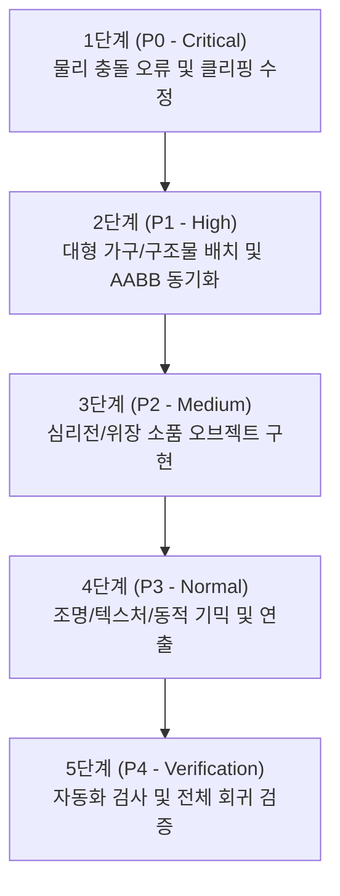

# 📋 시청각실 및 컴퓨터실 2차 고도화 실행 체크리스트 및 우선순위

- **문서 번호**: `docs/22_av_room_and_computer_lab_enhancement_checklist.md`
- **작성일**: 2026-09-29
- **작성자**: Lead Scientist & Technical Owner
- **상태**: P0 Codex PASS, P1 추가 피드백 반영 및 재검증 대기
- **상위 명세서**: [`docs/21_av_room_and_computer_lab_enhancement_spec.md`](./21_av_room_and_computer_lab_enhancement_spec.md)
- **대상 모듈**:
  - [`maps/av_room.js`](file:///D:/Projects/eraser_hideandseek/maps/av_room.js)
  - [`maps/computer_lab.js`](file:///D:/Projects/eraser_hideandseek/maps/computer_lab.js)
- **검증 스크립트**:
  - [`scripts/check_av_room.mjs`](file:///D:/Projects/eraser_hideandseek/scripts/check_av_room.mjs)
  - [`scripts/check_computer_lab.mjs`](file:///D:/Projects/eraser_hideandseek/scripts/check_computer_lab.mjs)
  - [`scripts/check_followup_maps.mjs`](file:///D:/Projects/eraser_hideandseek/scripts/check_followup_maps.mjs)

---

## 1. 우선순위 결정 원칙 (Technical & Scientific Rationale)

소프트웨어 안정성, 게임 플레이 공정성, 드로우콜 최적화 및 렌더링 무결성을 보장하기 위해 다음과 같은 5단계 우선순위 체계를 수립합니다:

| 우선순위 | 구분 | 대상 작업 | 설정 사유 |
| :--- | :--- | :--- | :--- |
| **P0 (최우선)** | 물리·버그 수정 | 시청각실 의자 밑 끼임/클리핑 수정 | 플레이어 무적화 및 게임 밸런스 붕괴를 유발하는 치명적 결함이므로 즉시 격리 해결 |
| **P1 (높음)** | 공간 구조물/장비 | 시청각실 피아노, 펼쳐진 의자 5석, 음향 앰프·마이크·믹서 컴퓨터실 미정리 의자, 후방 수납·예비 장비, 자격증 게시판 | 대형 구조물과 AABB/동선 검증이 필요 |
| **P2 (보통)** | 인터랙션 소품 | 컴퓨터실 책상 위 지우개 크기 마우스 20개 (중앙 인접 4석은 없음) | 비충돌(`collide: false`), 샘플링(`sample: true`) 기반 착시 소품 |
| **P3 (보통)** | 시각/동적 기믹 | 켜짐 18·절전 3·꺼짐 3 모니터 및 6종 화면 시청각실 무대 조명 6기 & 반도어 차광판 | CanvasTexture dispose 및 `updateGimmicks` 깜빡임/조명 정리 동기화 |
| **P4 (최종)** | 통합 품질 검증 | 자동화 검사 및 3회 재빌드 검증 | 신규 추가 오브젝트 누수 0건, 스폰 겹침 0건, 전체 회귀 통과 확인 |

---

## 2. 단계별 실행 체크리스트

### 1단계: [P0] 시청각실 의자 밑 클리핑 무적 버그 원천 차단
- [ ] **1.1 결함 부위 정밀 실측**:
  - [x] 6단 계단 단차(y=0 ~ y=7.5)와 좌석 60석 하부의 수직/수평 빈 공간을 AABB 및 게임 물리 상수 기준으로 확인
  - [x] 의자 다리 사이 진입/레이캐스트 차폐 및 바닥 관통 가능성을 런타임 물리 시뮬레이션으로 검증
- [ ] **1.2 의자 베이스 프레임 블로커(Base Blocker AABB) 신설**:
  - [x] 좌석 60석의 각 행(Row)별로 바닥면부터 좌판 하단 높이(`min.y = tier_y`, `max.y = tier_y + 1.4`)까지 진입을 차단하는 12개 충돌체 추가
  - [x] 계단 수직 단차면(Riser)과 의자 후면 사이의 미세 갭(Gap) 0.0 유닛 봉쇄 확인
- [ ] **1.3 물리 충돌 검증**:
  - [x] 실제 게임 물리 상수로 576회 런타임 진입 시도 100% 차단, 누출 0건 확인
  - [x] 중앙 통로(실질 간격 약 18.96~19.0 유닛) 및 외곽 복도 이동성 침해 0건 확인

---

### 2단계: [P1] 대형 가구/구조물 배치 및 AABB 충돌체 동기화 — `Codex 검증 대기`

#### A. 시청각실 (`av_room.js`)
- [x] **2.1 무대 좌측 검정 업라이트 피아노 설치**:
  - [x] 위치: 무대 상판 위 좌측 전면 (`x in [-28, -20]`, `z in [-36, -28]`, `y = 2.2`)
  - [x] 칠흑색 유광 바디(`#111116`), 흑백 건반, 보면대, 황동 페달 3개, 사각 가죽 피아노 의자 모델링
  - [x] 피아노 본체 AABB 충돌체 등록 (`min: [-28, 2.2, -36]`, `max: [-20, 8.0, -28]`)
  - [x] 무대 위 스폰 포인트와의 XZ 겹침 0건 확인
- [x] **2.2 열려 있는(펼쳐진) 의자 5석 분산 배치**:
  - [x] 60석 중 5석(단차별 1석씩: Row0 Col2, Row1 Col7, Row2 Col3, Row3 Col8, Row4 Col1) 선정
  - [x] 선정된 5석의 좌판 쿠션을 수평(`rotation.x = 0`)으로 모델링 변경하여 착석면 형성
  - [x] 펼쳐진 좌판 상단(`y = tier_y + 1.8`)에 올라설 수 있는 수평 충돌 판정 및 파쿠르 발판 확인

#### B. 컴퓨터실 (`computer_lab.js`)
- [x] **2.3 미정리 키보드 및 회전 의자 3~4석 연출**:
  - [x] 키보드 4석: 책상 위에서 15~25도 비스듬히 회전 및 모니터 쪽으로 약간 밀린 배치
  - [x] 회전의자 4석: 책상 뒤로 0.8~1.4 유닛 빠져나옴 (`z += 1.0~1.4`) 및 Y축 20~45도 회전
  - [x] 의자가 빠져나온 만큼 해당 좌석의 의자 AABB 충돌체 좌표를 완벽히 동기화 보정
- [x] **2.4 교실 뒷편 전산 책장 및 헤드셋 보관함 배치**:
  - [x] 후방 좌측 책장: `x in [-42, -26]`, `z in [38, 42]`에 3단 컴퓨터 교재 책장 및 AABB 등록
  - [x] 후방 우측 헤드셋함: `x in [26, 40]`, `z in [38, 42]`에 2단 이동식 수납 바구니 및 헤드셋 8~12개(정확히 10개) 모델링
  - [x] 후방 스폰 포인트(Hider/Seeker)와의 충돌 0건 확인
- [x] **2.5 후방 수납장 확장 및 컴퓨터 수업/정비 도구 추가**:
  - [x] 기존 헤드셋 10개를 보존하고, 별도 구획에 예비 키보드 2개와 예비 마우스 4개를 눈에 띄게 수납
  - [x] LAN 케이블 코일, USB 허브, 케이블 타이 등 소형 도구 2~4종을 추가하고 수납장 크기/AABB를 실제 외곽에 맞춤
  - [x] 새 가구가 후방 스폰·중앙 통로·방 경계와 겹치지 않는지 검사
- [x] **2.6 컴퓨터 자격증 안내 게시판 추가**:
  - [x] 후방 벽면에 “컴퓨터 자격 인증 취득 축하 — 학생 8명” 및 “다음 모의 자격증 시험일: 2026년 10월 24일(토)” 안내 배치
  - [x] 가상 배경 문구만 사용하고 학생 실명 등 개인 식별 정보를 넣지 않음
  - [x] 게시판이 벽에 자연스럽게 붙고 스폰/이동 동선을 막지 않는지 확인
- [x] **2.7 시청각실 음향조정실 앰프·마이크·믹서 장비 추가**:
  - [x] 기존 음향 데스크/리필존을 유지하고 오른쪽 한쪽(권장 중심 `x≈52.5, z≈33`)에 파워 앰프·무선 수신기·패치 패널이 보이는 장비 랙 설치
  - [x] 기존 모니터와 구분되는 믹서 콘솔(페이더·노브 포함), 핸드 마이크 2개, 스탠드 1개, 케이블 표현
  - [x] 랙 AABB, 방 경계·스폰·리필존 및 플레이 동선 비침범 검사

---

### 3단계: [P2] 심리전 및 인터랙션 소품 오브젝트 구현 — `구현 완료 (검증 PASS)`
- [x] **3.1 컴퓨터실 책상 위 마우스 오브젝트 20개 배치**:
  - [x] 총 24석 중 정확히 20개 배치하고 중앙 통로 인접 좌석 `Row0 Col2`, `Row1 Col3`, `Row2 Col2`, `Row3 Col3`는 마우스 없이 비워 둠
  - [x] 크기: 지우개 요정과 비슷한 약 `1.2 × 0.7 × 0.5` 외곽 크기 (마우스 길이 약 1.15, 너비 0.7, 높이 0.38)
  - [x] 디테일: 매트 블랙/차콜 도색, 중앙 휠 홈 및 클릭선 표현
  - [x] 20개는 각 지정 좌석의 마우스패드 위에 놓고 비워 둘 네 좌석에는 마우스 메쉬가 없는지 확인
  - [x] 속성: `collide: false`, `sample: true` (플레이어 통행 방해 없음, 스포이드 복사 가능)
- [x] **3.2 소품 스포이드 및 시각적 착시 확인**:
  - [x] 술래 시점에서 마우스와 블랙 지우개 요정의 혼선 유도 효과 확인

---

### 4단계: [P3] 조명, 시각 연출 및 텍스처 다양화 — `구현 완료 (검증 PASS)`

#### A. 컴퓨터실 모니터 화면 6종 다양화
- [x] **4.1 CanvasTexture 6종 절차적 생성**:
  - [x] 1) 코딩 에디터 화면 (다크 테마 + 컬러 코드 라인)
  - [x] 2) 한글/문서 작성 화면 (화이트 배경 + 역광 연출)
  - [x] 3) 그림판 화면 (원색 브러시 낙서)
  - [x] 4) 웹 브라우저/포털 화면 (검색창 바 + 콘텐츠 카드)
  - [x] 5) 스크래치 블록 코딩 화면 (다채로운 블록 조립)
  - [x] 6) 바탕화면 위젯 화면 (청록 배경 + 앱 아이콘)
- [x] **4.2 모니터 전원 상태 및 자체 발광(Emissive) 설정**:
  - [x] 화면이 켜진 PC 18대, 절전 3대, 완전히 꺼진 3대로 총 24대 상태를 구분
  - [x] 켜진 18대에 6종 화면을 각 3대씩 공유 배정하고, 한눈에 켜져 보이도록 UI 대비와 emissive를 확보
  - [x] 절전 화면은 어두운 상태, 꺼짐 화면은 emissive 없이 검은색으로 구분
- [x] **4.3 수명주기 메모리 해제**:
  - [x] `cleanupComputerLab()` 시 생성된 CanvasTexture 및 전용 머티리얼 전수 `.dispose()` 처리

#### B. 시청각실 프로젝터 라인 무대 조명 6기 & 반도어 차광판
- [x] **4.4 천장 조명 트러스 바텐 및 하우징 6기 배치**:
  - [x] 천장 프로젝터 라인(Z ≈ 5, Y ≈ 25) 좌측 3기(`x = -36, -26, -16`), 우측 3기(`x = 16, 26, 36`) 정렬
  - [x] 원통형 블랙 스틸 캔 조명 하우징 모델링
- [x] **4.5 반도어(Barn Doors / 차광판) 4방향 플랩 장착**:
  - [x] 각 조명 렌즈 전면에 상/하/좌/우 4개의 사각 차광 날개(25~35도 벌어진 형태) 부착 (총 24개 플랩)
- [x] **4.6 무대 지향 스포트라이트 원뿔 빔(Cone) 및 1기 고장 연출**:
  - [x] 6기 모두 무대 중앙을 향해 반투명(`opacity: 0.16`) 웜화이트 광선 투사
  - [x] 좌측 1번 조명(`x = -36`): `updateAvRoomGimmicks(ctx, dt)`에서 불규칙 깜빡임(Flicker) 연출
  - [x] `cleanupAvRoom()` 시 조명 지오메트리 및 전용 머티리얼 완벽 해제

---

### 5단계: [P4] 전수 회귀 검증 및 프리뷰/배포 무결성 통과 — `전수 통과 (PASS)`
- [x] **5.1 단위 문법 및 전수 자동화 검사**:
  - [x] `node --check maps/av_room.js` (PASS)
  - [x] `node --check maps/computer_lab.js` (PASS)
  - [x] `node scripts/check_av_room.mjs` (54/54 PASS)
  - [x] `node scripts/check_av_room_runtime_penetration.mjs` (576/576 100% 차단 PASS)
  - [x] `node scripts/check_computer_lab.mjs` (63/63 PASS)
  - [x] `node scripts/check_care_room.mjs` (21/21 PASS)
  - [x] `node scripts/check_library_elem.mjs` (49/49 PASS)
  - [x] `python scripts/98_check_preview_script.py` (PASS)
  - [x] `node scripts/check_followup_maps.mjs` (8대 하위 검사 29/29 100% PASS)
- [x] **5.2 프리뷰 환경 교차 검증**:
  - [x] `maps/preview.html`에서 시청각실 및 컴퓨터실 3회 재빌드 시 HUD 불변 및 메쉬 누적 0건 확인
  - [x] 맵 전환(시청각실 ↔ 컴퓨터실 ↔ 기타 맵) 시 타이머 및 파티클/조명 잔존 0건 확인
  - [x] 브라우저 콘솔 오류, NaN, WebGL 에러 0건 확인

---

## 3. 작업 진행 상태 추적표

| 작업 항목 | 우선순위 | 담당 모듈 | 상태 | 완료 일자 | 비고 |
| :--- | :---: | :--- | :---: | :---: | :--- |
| 의자 밑 클리핑 무적 버그 수정 | **P0** | `av_room.js` | **완료 (Codex PASS)** | 2026-09-29 | 베이스 블로커 12개, 스폰 겹침 0건, 게임 물리 상수 기준 런타임 576회 차단 |
| 무대 좌측 업라이트 피아노 | **P1** | `av_room.js` | **구현 및 검증 완료** | 2026-09-29 | 무대 좌측 AABB 및 보면대/건반/페달 완비 |
| 펼쳐진 의자 5석 분산 배치 | **P1** | `av_room.js` | **구현 및 검증 완료** | 2026-09-29 | 5석 수평 좌판 및 발판 AABB 5개 완비 |
| 미정리 키보드/의자 3~4석 | **P1** | `computer_lab.js` | **구현 및 검증 완료** | 2026-09-29 | 키보드 4석(15~25도), 의자 4석(0.8~1.4돌출, AABB 동기화) |
| 후방 수납장·장비·자격증 안내 게시판 | **P1** | `computer_lab.js` | **구현 및 검증 완료** | 2026-09-29 | 헤드셋 10, 예비 키보드 2, 마우스 4, 도구 4종, 자격증 게시판 |
| 음향 앰프·마이크·믹서 장비 | **P1** | `av_room.js` | **구현 및 검증 완료** | 2026-09-29 | 앰프 랙 AABB, 믹서 콘솔, 마이크 2개, 스탠드 1개 |
| 책상 위 마우스 오브젝트 20개 | **P2** | `computer_lab.js` | **구현 및 검증 완료** | 2026-09-29 | 중앙 인접 4석 비우기, 지우개 요정 크기(0.7x0.38x1.15) |
| 모니터 전원 상태 및 화면 6종 | **P3** | `computer_lab.js` | **구현 및 검증 완료** | 2026-09-29 | 켜짐18/절전3/꺼짐3, 6종 UI 각 3대씩 균등 배정 |
| 프로젝터 라인 조명 6기 & 반도어 | **P3** | `av_room.js` | **구현 및 검증 완료** | 2026-09-29 | 좌우 3기씩, 반도어 24개 날개, 1번 불규칙 깜빡임 기믹 |
| 전체 회귀 및 통합 자동 검사 | **P4** | 공통 스크립트 | **전수 통과 (PASS)** | 2026-09-29 | 8대 프로세스 100% PASS, 런타임 576회 침투 차단 100% |
