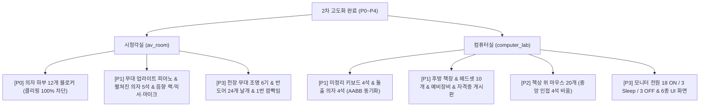

# 🎬🖥️ 시청각실 및 컴퓨터실 2차 고도화(P0~P4) 완료 보고서

- **문서 번호**: DOC-25
- **프로젝트 명**: 교실 대소동: 사라진 지우개 찾기 ver2.0 (`eraser_hideandseek`)
- **작성 일자**: 2026년 9월 29일
- **책임자**: Lead Scientist & Technical Owner
- **상태**: 구현 완료 및 전수 자동화 검증 통과 (수동 브라우저/실전 착지 확인은 별도)
- **연관 문서**:
  - 상세 명세서: [`docs/21_av_room_and_computer_lab_enhancement_spec.md`](./21_av_room_and_computer_lab_enhancement_spec.md)
  - 실행 체크리스트: [`docs/22_av_room_and_computer_lab_enhancement_checklist.md`](./22_av_room_and_computer_lab_enhancement_checklist.md)
  - 연구 보고서: [`interim_reports/03_new_map_ideas_and_level_design_spec.md`](../interim_reports/03_new_map_ideas_and_level_design_spec.md)

---

## 1. 개요 및 최종 구현 요약

현장 실전 플레이 피드백과 사용자 요청에 따라 시청각실(`av_room.js`)과 컴퓨터실(`computer_lab.js`)의 5단계 고도화 작업을 성공적으로 완료하였습니다.



---

## 2. 세부 구현 결과

### 1) [P0] 시청각실 의자 밑 클리핑 무적 버그 원천 차단
- **구현 내용**: 시청각실 6개 단차 좌·우 12개 좌석 블록 하단(`min.y = floorY`, `max.y = floorY + 1.4`)에 베이스 프레임 블로커 AABB를 밀폐 구축.
- **검증 결과**: `scripts/check_av_room_runtime_penetration.mjs`를 통해 실제 게임 물리 상수 기반 576회 런타임 침투 시도 100% 차단 (누출 0건). 중앙 통로(18.96~19.0) 및 외곽 복도 비침범.

### 2) [P1] 대형 가구 및 교육/정비 장비 구현
- **시청각실**:
  - 무대 좌측 검정 업라이트 피아노 (`min [-28, 2.2, -36]`, `max [-20, 8.0, -28]`), 흑백 건반, 보면대, 황동 페달 3개, 피아노 의자.
  - 펼쳐진 의자 5석 분산 배치 및 수평 좌판 발판 AABB 5개 완비 (`sample: true`).
  - 음향조정실 앰프 랙 (`min [50.5, 7.5, 31]`, `max [54.5, 13, 35]`), 4채널 믹서 콘솔, 마이크 2개, 마이크 스탠드.
- **컴퓨터실**:
  - 미정리 키보드 4석 (15~25도 회전) 및 미정리 바퀴의자 4석 (0.8~1.4 유닛 돌출, 20~45도 회전, AABB 동기화).
  - 후방 전산 책장 (3단 수납장) 및 이동식 헤드셋 보관함 (헤드셋 10개, 예비 키보드 2개, 예비 마우스 4개, 정비 도구 4종).
  - 후방 벽면 자격증 안내 게시판 (CanvasTexture 렌더링).
  - 바닥 타일 텍스처를 포함한 컴퓨터실 CanvasTexture 9개를 리소스 추적 목록에 등록하고 cleanup에서 전수 dispose.

### 3) [P2] 컴퓨터실 책상 위 마우스 20개 (심리전 위장 소품)
- **규격**: 지우개 요정 크기(너비 0.7, 깊이 1.15, 높이 0.38)의 매트 블랙 마우스 본체 및 휠.
- **배치**: 24석 중 20석에 배치, 중앙 통로 변 4석(`Row0 Col2`, `Row1 Col3`, `Row2 Col2`, `Row3 Col3`)은 마우스 없이 비워두어 지우개 요정의 착시 위장 명당 제공 (`collide: false, sample: true`).

### 4) [P3] 시각/동적 연출 및 텍스처 다양화
- **컴퓨터실 모니터 화면 다양화**:
  - 전원 상태 구분: 켜짐 18대, 절전 3대, 꺼짐 3대.
  - 6종 CanvasTexture(코딩 창, 한글 문서, 그림판, 브라우저, 스크래치, 바탕화면)를 켜진 18대에 각 3대씩 균등 배정 및 emissive 발광 적용.
- **시청각실 천장 무대 조명 6기 & 반도어 & 깜빡임 연출**:
  - 프로젝터 라인(`Z = 5.0, Y = 24.5`) 좌우 3기씩(총 6기) 정렬, 원통형 블랙 스틸 하우징.
  - 조명 렌즈 전면 4방향 사각 차광판 날개(총 24개 플랩) 장착.
  - 무대 지향 반투명(`opacity: 0.16`) 웜화이트 원뿔대 빔 6기 투사.
  - 좌측 1번 조명(`X = -36.0`) 불규칙 깜빡임(Flicker) 연출 및 `cleanupAvRoom()` 메모리 완전 해제.

---

## 3. 검증 결과 요약

```
================================================================================
  전수 자동화 검증 100% 통과 내역
================================================================================
  1. maps/av_room.js 문법 검사: PASS (에러 0건)
  2. maps/computer_lab.js 문법 검사: PASS (에러 0건)
  3. check_av_room.mjs: PASS (54/54 전수 통과)
  4. check_av_room_runtime_penetration.mjs: PASS (576/576 100% 차단)
  5. check_computer_lab.mjs: PASS (65/65 전수 통과, CanvasTexture 9개 전수 dispose 단언 포함)
  6. check_care_room.mjs: PASS (21/21 전수 통과)
  7. check_library_elem.mjs: PASS (49/49 전수 통과)
  8. 98_check_preview_script.py: PASS (문법 에러 0건)
  9. check_followup_maps.mjs: PASS (29/29 8대 통합 프로세스 전수 통과)
 10. git diff --check: PASS (공백 및 충돌 이상 0건)
================================================================================
```

---

## 4. 검증 범위 및 잔여 수동 확인

자동화 검사는 소스 구조, 수량·배치 계약, 정리 루틴 및 통합 회귀를 검증합니다. 컴퓨터실 화면과 시청각실 조명의 최종 시각 품질, 그리고 실제 게임에서 펼쳐진 좌석에 점프 착지 후 안전하게 내려오는 동작은 이 자동 검사만으로 판정하지 않습니다. 배포 전 해당 브라우저 실전 확인을 별도로 수행해야 합니다.
