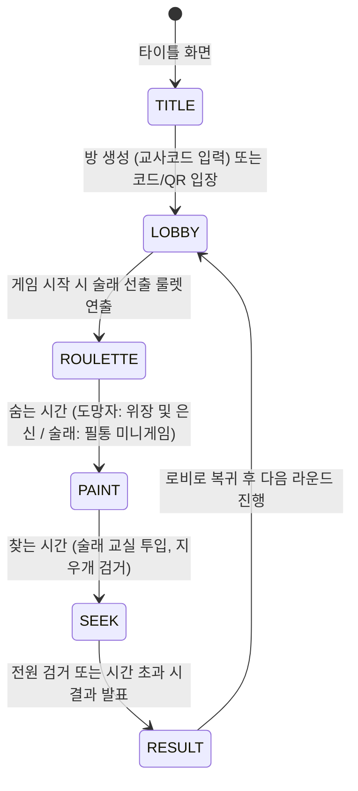

# 교실 대소동: 사라진 지우개 찾기 ver2.0 (`index (배포용).html`) 정밀 분석 보고서

## 1. 개요 및 요약
- **프로젝트 명**: 교실 대소동: 사라진 지우개 찾기 ver2.0
- **원작자/개발자**: 하루담이 (`TEACHER_CODE` 기본값)
- **제작/배포일**: 2026. 07. 12
- **공식 레퍼런스 배포처**: [https://find-eraser2.netlify.app/](https://find-eraser2.netlify.app/)
- **대상 파일**: [`index (배포용).html`](file:///D:/Projects/eraser_hideandseek/index%20%28%EB%B0%B0%ED%8F%AC%EC%9A%A9%29.html) / 배포 파일: [`index.html`](file:///D:/Projects/eraser_hideandseek/index.html)
- **파일 크기**: 277,084 바이트 (약 270KB)
- **전체 코드 라인 수**: 5,217줄 (HTML DOM: ~662줄 / CSS: ~343줄 / JavaScript ES 모듈: ~4,552줄)
- **프로젝트 성격**: 초등학교/중학교 교실 수업 및 학급 활동을 위해 특화 설계된 **단일 파일(Single-file) 독립 실행형 3D 웹 멀티플레이어 숨바꼭질 게임**입니다.
- **핵심 특징**: 별도의 서버 인프라 구축이나 외부 이미지/3D 에셋/사운드 파일 다운로드 없이, HTML 파일 하나만 브라우저에서 열거나 Netlify/GitHub Pages에 드롭하면 즉시 수업에 활용할 수 있는 **Zero-Asset 아키텍처**로 제작되었습니다.

---

## 2. 시스템 아키텍처 및 기술 스택

### 2.1 주요 기술 구성
| 구분 | 기술 / 라이브러리 | 용도 및 구현 방식 |
| :--- | :--- | :--- |
| **3D 렌더링** | Three.js (r160, ES Module) | WebGL 캔버스 렌더러, 조명, 셰이더, 동적 그림자, 카메라 제어 |
| **네트워크** | Firebase Realtime Database (v9.23.0) | 방 생성/참여, 호스트 선출, 위치/포즈 동기화, 페인팅 텍스처 동기화, 하트비트 |
| **텍스처/그래픽** | HTML5 2D Canvas API (절차적 생성) | 교실 바닥, 칠판, 책상 나무결, 지우개 표면 등 모든 텍스처를 코드로 실시간 렌더링 |
| **오디오 엔진** | Web Audio API (합성 사운드) | 외부 MP3 없이 오실레이터, 노이즈 버퍼, 바이쿼드 필터를 통해 효과음 및 BGM 합성 |
| **QR 코드 생성** | qrcode-generator (v1.4.4) | 전자칠판/TV에 접속 QR 코드를 표시하여 학생 모바일/태블릿 즉시 참여 유도 |
| **물리/충돌** | 자체 구현 경량 AABB & Raycast | 계단 오르기, 장애물 충돌, 바닥 높이 판정, 스포이드/검거 판정 |

### 2.2 디렉터리 및 코드 구조 (단일 파일 내부)
- **Lines 1 ~ 343**: CSS 스타일시트 (레트로 칠판/문구점 감성의 반응형 UI 디자인, 모바일 가상 패드, TV HUD)
- **Lines 344 ~ 398**: Import Map (Three.js), 외부 QR 라이브러리, **선생님 환경설정 구역 (Firebase Config 및 교사 인증 코드)**
- **Lines 399 ~ 662**: HTML DOM 구조 (타이틀, 로비, 게임 HUD, TV 모드 오버레이, 물감 패스, 필통 미니게임, 결과창)
- **Lines 663 ~ 5217**: 핵심 JavaScript 게임 엔진 (단일 `<script type="module">`)

---

## 3. 핵심 게임 메커니즘 분석

### 3.1 역할 구분 및 승패 규칙
1. **지우개 요정 (도망자/학생들)**
   - 새하얀 지우개 캐릭터로 교실에 스폰됩니다.
   - **스포이드 및 페인팅 시스템**: 주변 환경(책상, 책, 바닥, 사물함 등)을 클릭/터치하여 색상과 텍스처를 추출하고, 자신의 지우개 몸체에 물감을 칠해 완벽히 카멜레온처럼 위장합니다.
   - **포즈(Pose) 변환**: 서기(Stand), 눕기(Lie down), 옆으로 기울이기 등 실제 책상 위에 굴러다니는 진짜 지우개처럼 자세를 취할 수 있습니다.
2. **연필 술래 (추적자)**
   - 로비에서 무작위 룰렛 또는 교사 수동 지정을 통해 선출됩니다.
   - **숨는 시간 (기본 60초)**: 술래는 화면이 가려진 채 **필통 속(Pencil Case)**에 대기하며, 지루함을 달래기 위한 **지우개 똥 터뜨리기 미니게임**을 플레이합니다.
   - **찾는 시간 (기본 120초)**: 교실로 나와 1인칭 조준점(Crosshair)으로 의심스러운 지우개를 조준하여 클릭/터치로 검거합니다.
3. **선생님 (호스트/관전)**
   - 게임에 직접 요정이나 술래로 참여할 수도 있고, 순수 관전자로서 대형 TV 화면 송출 및 게임 진행을 총괄할 수 있습니다.

### 3.2 페이즈 상태 머신 (Phase State Machine)

---

## 4. 맵 시스템 (4개 내장 맵 및 GLB 확장)

코드로 직접 3D 지오메트리와 오브젝트를 절차적으로 생성하는 4종의 맵이 내장되어 있습니다:
1. **교실 (`classroom`)**: 120 × 90 유닛. 학생 책상/걸상 세트, 교탁, 대형 칠판, 창문, 사물함, 청소도구함 등 배치.
2. **과학실 (`science`)**: 실험대, 싱크대, 시약병, 비커, 플라스크, 현미경 등이 배치되어 색상 추출 요소가 다양함.
3. **급식실 (`cafeteria`)**: 배식대, 긴 식탁과 벤치, 식판, 수저통 등이 배치되어 밝고 넓은 공간 위장.
4. **도서관 (`library`)**: 미로 같은 대형 책장들, 열람 테이블, 그리고 실시간으로 움직이는 **도서 운반 카트(`updateBookCarts`)** 기믹이 포함됨.
5. **GLB 커스텀 맵 로더 지원**: Blender에서 제작한 3D 맵을 Base64로 내장할 수 있으며, 네이밍 규칙(`COL_` = 보이지 않는 충돌체, `SPAWN_H_` = 요정 스폰, `SPAWN_S_` = 술래 스폰)을 자동 파싱합니다.

---

## 5. 학교 수업 현장 맞춤형 특화 기능 (Classroom UX)

1. **선생님 방 개설 보안 (`TEACHER_CODE`)**
   - 학생들이 장난으로 방을 무단 생성하는 것을 방지하기 위해 `TEACHER_CODE`("하루담이" 기본값) 인증을 거쳐야 방 생성이 가능합니다.
2. **전자칠판/TV 전용 조망 모드 (TV Mode)**
   - 교실 앞 TV에 띄울 수 있는 전용 뷰로, 맵 전체 부감 화면과 술래 1인칭/3인칭 추적 카메라를 원클릭으로 전환할 수 있습니다.
   - 대형 타이머 및 생존자 아이콘이 TV 화면 상단에 큼직하게 표시됩니다.
3. **선생님 전용 긴급 통제 패널**
   - **얼음! (Freeze)**: 학생들이 흥분하거나 교사의 안내가 필요할 때 전체 플레이어의 조작을 강제 동결하고 화면에 "얼음!" 알림 팝업.
   - **시간 연장/단축**: 30초 단위로 라운드 남은 시간을 즉시 늘리거나 줄임.
   - **페이즈 강제 전환 / 라운드 강제 종료**: 수업 종소리 등에 맞춰 즉각 통제 가능.
   - **정전 기믹 (Blackout)**: 교실 조명을 모두 끄고 손전등 라이트만 비추는 스릴 모드 토글.
4. **모바일 최적화 및 1초 입장**
   - 스마트폰/태블릿을 위한 터치 조이스틱 및 가상 버튼 제공.
   - 로비의 QR 코드를 돋보기 모드로 대형화하여 교실 뒷자리 학생도 카메라로 즉시 스캔 가능.

---

## 6. 네트워크 및 상태 동기화 아키텍처

- **백엔드**: Firebase Realtime Database
- **연결 복원력**:
  - 학교 전산망 특유의 방화벽, 유해정보 차단 필터, 웹소켓 차단 환경을 자동 감지합니다.
  - 웹소켓 연결 지연 시 롱폴링(Long-polling) 모드로 자동 폴백(Fallback)하며 진단 메시지를 화면에 출력합니다.
- **데이터 구조**:
  - `/rooms/{roomCode}/meta`: 게임 페이즈, 라운드 타이머, 맵 ID, 얼음 여부, 설정값
  - `/rooms/{roomCode}/players/{uid}`: 닉네임, 역할(요정/술래), 검거 여부, 호스트 여부
  - `/rooms/{roomCode}/positions/{uid}`: 실시간 x, y, z 좌표, yaw, pitch, pose 상태 (20Hz 쓰로틀 전송 + 클라이언트 lerp 보간)
  - `/rooms/{roomCode}/textures/{uid}`: 플레이어가 몸체에 칠한 페인팅 캔버스 Base64 데이터 동기화
  - `/rooms/{roomCode}/presence/{uid}`: 접속 유지 하트비트 및 방 이탈 자동 감지 (`onDisconnect`)

---

## 7. 오디오 및 비주얼 이펙트 시스템

1. **Web Audio 합성 사운드 (`Audio2` / `Music`)**:
   - `sfxSpray`: 대역통과 필터(2200Hz)와 노이즈 버퍼를 활용한 실제 락카/스프레이 분사음.
   - `sfxDrop` / `sfxStep`: 사인파 피치 벤드를 이용한 발걸음 및 지우개 털썩 착지음.
   - `sfxFound`: [660, 880, 1320]Hz 삼각파 아르페지오를 활용한 검거 팡파르.
   - `Music.PAINT` / `Music.SEEK`: 숨는 시간의 경쾌한 BGM과 찾는 시간의 긴장감 넘치는 베이스라인 시퀀서.
2. **비주얼 연출**:
   - 지우개 파편 파티클, 물감 스프레이 분사 파티클, 검거 시 별가루 폭발 이펙트.

---

## 8. 종합 평가 및 시사점

- **완성도**: 단일 HTML 파일 내에 3D 그래픽, 멀티플레이어 동기화, UI, 사운드, 교실 관리 도구가 모두 포함된 매우 완성도 높은 에듀테크/게임 프로젝트입니다.
- **수정 및 설정 필요 사항**: 현재 파일의 376~382행에 Firebase 설정(`firebaseConfig`)이 `"여기에_붙여넣기"`로 되어 있어, 실제 멀티플레이를 운영하려면 유효한 Firebase Realtime Database 키를 삽입해야 정상 동작합니다 (혼자 연습하기 모드는 즉시 플레이 가능).

---

## 9. 배포 준비 및 작업 현황 (업데이트)

1. **가이드 문서 구축**:
   - 사용자 지침에 따라 서버 구축 및 배포 가이드라인을 담은 [`guide.md`](file:///D:/Projects/eraser_hideandseek/guide.md) 생성 완료.
2. **배포용 표준 엔트리포인트 구성**:
   - 원본 불변성 유지를 위해 `index (배포용).html`을 [`primary_data/`](file:///D:/Projects/eraser_hideandseek/primary_data/)로 안전 백업.
   - 웹 서버 및 정적 호스팅(GitHub Pages / Netlify) 표준 규격에 맞추어 루트에 [`index.html`](file:///D:/Projects/eraser_hideandseek/index.html) 배포 파일 생성 완료.
3. **현재 대기 상태**:
   - 사용자의 Firebase 콘솔 발급 정보(`firebaseConfig`) 및 원하는 교사 인증 코드(`TEACHER_CODE`) 전달 시 [`index.html`](file:///D:/Projects/eraser_hideandseek/index.html)의 375~388행을 즉시 업데이트할 수 있도록 준비 완료.

---

## 10. 현장 피드백 분석: 아이패드 10세대 사파리(Safari) 화면 확대 고정 이슈

### 10.1 현상 분석
- **발생 기기/환경**: iPad 10세대 (10.9형 레티나 디스플레이, iPadOS 16/17/18), Safari 브라우저
- **주요 증상**:
  - 게임 접속 또는 플레이 도중 화면이 확대(Zoom-in)된 후 원래 크기로 축소되지 않음 (Zoom Lock 현상).
  - 화면이 확대되면서 모바일 가상 조이스틱(`innerWidth * 0.45` 판정 영역 및 `#joyBase`)과 조작 버튼들이 시각적 뷰포트 밖으로 밀려남.
  - 학생이 화면 좌측을 터치해도 조이스틱이 인식되지 않아 방향키 조작 및 게임 참여 불가.

### 10.2 기술적 근본 원인 (Root Causes)
1. **iPadOS 사파리의 데스크톱 사이트 요청 모드 & `user-scalable=no` 무시**:
   - iPadOS Safari는 기본적으로 데스크톱 브라우징 모드로 동작하여 뷰포트 메타 태그의 `user-scalable=no`를 무시함.
2. **양손 멀티 터치 시 핀치 줌(Pinch-to-zoom) 오작동**:
   - 왼손 엄지(이동)와 오른손 엄지(시점 회전/점프)를 동시에 누르고 움직일 때 Safari가 이를 핀치 줌 제스처로 오인하여 브라우저 창 전체를 확대함.
3. **가상 버튼 연타 시 더블 탭 확대(Double-tap to zoom)**:
   - 점프나 스포이드 등을 300ms 이내에 빠르게 2회 탭하면 Safari의 내장 더블 탭 확대 기능이 발동됨.
4. **CSS `overflow: hidden`과 `touch-action: none`의 역설**:
   - 확대가 한 번 발생하면, 게임 내 CSS 설정으로 인해 사용자가 두 손가락으로 다시 축소(Pinch-out)하려는 제스처마저 브라우저가 차단하여 확대된 채 갇히게 됨.
5. **로비 텍스트 입력 시 Input Focus Zoom**:
   - 닉네임/방 코드 입력 시 가상 키보드가 열리며 화면이 줌인된 뒤, 키보드가 닫혀도 뷰포트 스크롤과 배율이 원상 복구되지 않음.

### 10.3 종합 해결 방안 (5계층 방어 체계)
1. **뷰포트 메타 태그 보강**: `minimum-scale=1.0, shrink-to-fit=no, viewport-fit=cover` 추가.
2. **사파리 제스처 원천 차단**: `gesturestart`, `gesturechange`, `gestureend`에 `e.preventDefault({ passive: false })` 바인딩.
3. **더블 탭 및 다중 터치 줌 방어**: `touchmove`(2개 이상 터치 시 기본 동작 차단) 및 300ms 이내 연속 `touchend` 차단.
4. **입력창 포커스 아웃 시 뷰포트 강제 원복**: `focusout` 이벤트 발생 시 `window.scrollTo(0, 0)` 및 뷰포트 스케일 초기화.
5. **모바일 긴급 "화면 리셋" 복구 버튼 제공**: 화면 우측 상단에 작은 원터치 복구 버튼을 제공하여 비상 시 즉각 100% 원복 가능하도록 지원.

---

## 11. 게임 밸런스/버그 분석: 급식실 음식 밑에 누울 시 검거 불가(무적) 오류

### 11.1 현상 분석
- **발생 맵**: 급식실 (`cafeteria`)
- **버그 내용**:
  - 도망자(요정)가 배식대의 음식 트레이나 국솥 등 음식 오브젝트 위에 올라가서 "눕기(lie)" 자세를 취하면, 몸체가 음식 그래픽 속/밑으로 완전히 파묻힘.
  - 술래가 이를 눈치채고 바로 앞에서 조준하거나 클릭해도 전혀 검거(Catch)되지 않아 게임이 끝나지 않는 치명적인 무적 판정 발생.

### 11.2 기술적 근본 원인 (Code Root Cause)
1. **음식 데코레이션의 충돌체 부재 (`collide: false`)**:
   - `buildCafeteria()` 내 `dish()` 함수([1522~1525행](file:///D:/Projects/eraser_hideandseek/index.html#L1522-L1525))에서 기본 밥/소스 베이스 높이는 Y=5.45(두께 0.75)로 설정되어 있으나, 그 위에 얹어지는 **8종의 음식 덩어리(치킨, 불고기, 브로콜리 등) 및 고명**은 `{collide: false, sample: true}`로 생성됨.
   - 국솥의 주황색 국물 표면([1561행](file:///D:/Projects/eraser_hideandseek/index.html#L1561)) 역시 `{collide: false}`로 충돌체가 없음.
2. **눕기 자세 시의 극단적 높이 감소 (`POSE_H.lie = 0.4`)**:
   - 지우개의 서 있는 높이는 1.45이지만, 누우면 높이가 0.4로 급격히 얇아짐.
   - 충돌이 없는 음식 덩어리(높이 0.6) 사이/밑으로 지우개가 쏙 파고들어가 완전히 은폐됨.
   - 안티 치즈 시스템(`checkEmbedded()`)은 `colliders` 목록만 검사하므로, `collide: false`인 음식 덩어리 속에 파묻힌 플레이어를 감지하지 못함.
3. **가장 결정적인 원인: 술래 판정 차단 (`isJudgeBlocked`의 유령 차폐막 현상)**:
   - 술래가 조준/클릭할 때 장애물 차폐 검사를 수행하는 `isJudgeBlocked()`([3122~3132행](file:///D:/Projects/eraser_hideandseek/index.html#L3122-L3132)) 함수는 시야를 가리는 장애물로 `samplables`(스포이드 추출 가능한 모든 메쉬)를 검사함.
   - 음식 덩어리와 고명은 `{sample: true}`이므로 `samplables`에 등록되어 있음.
   - **충돌체는 없어서 플레이어는 통과하지만, 레이캐스트는 차단하는 '일방통행 방패'**가 형성되어, 술래가 음식 속의 플레이어를 조준해도 음식 메쉬가 레이를 가로막아 검거 판정이 100% 무효화(continue)됨.

### 11.3 해결 방안 (3중 해결책)
1. **음식 트레이 충돌체 높이 상향 보정**:
   - `dish()`의 베이스 충돌 박스 높이를 음식 덩어리 상단(Y=6.25)까지 확장하여, 플레이어가 음식 속으로 파고들지 못하고 **음식 덩어리 위에 올라앉도록 물리 충돌면 보정**.
   - 국솥 표면([1561행](file:///D:/Projects/eraser_hideandseek/index.html#L1561))에 충돌체(`collide: true`)를 부여하여 국물 속으로 가라앉지 못하도록 수정.
2. **`isJudgeBlocked()` 판정 로직 개선**:
   - `addBox`/`addCyl` 생성 시 `userData.solid` 속성을 기록.
   - `isJudgeBlocked()` 검사 시 `userData.solid === false`인 비충돌 장식 메쉬(음식 덩어리, 고명, 나뭇잎 등)는 시야 차폐물에서 제외하여, 설령 틈새에 숨어있더라도 술래가 찍으면 정상 검거되도록 판정 통과.

---

## 12. 공식 라이브 배포처(`https://find-eraser2.netlify.app/`) 대조 분석 결과

1. **라이브 버전과 로컬 배포용 파일의 관계**:
   - 공식 라이브 사이트([https://find-eraser2.netlify.app/](https://find-eraser2.netlify.app/))는 5개의 멀티 서버(`서버 1~5`)가 미리 설정된 공용 호스팅 버전입니다.
   - 본 프로젝트의 `index (배포용).html`은 원작자(하루담이 님)가 일선 학교 선생님들이 자체 Firebase 계정으로 "우리 반 전용 서버"를 5분 만에 무료 개설할 수 있도록 배포용으로 패키징한 템플릿입니다.
2. **버그 존재 여부 검증**:
   - 공식 라이브 사이트 코드를 직접 다운로드하여 비교 검증한 결과, **라이브 사이트에도 '아이패드 사파리 제스처 줌 방지' 및 '급식실 음식 밑 눕기 무적 버그'가 동일하게 미해결 상태로 존재**함을 확인했습니다.
---

## 13. GitHub Pages 배포 준비 및 패치 적용 완료 (v2.0.1)

1. **2대 핵심 버그 패치 적용 완료**:
   - [`index.html`](file:///D:/Projects/eraser_hideandseek/index.html) 파일에 **아이패드 사파리 제스처 확대 차단/화면 맞춤 버튼** 및 **급식실 음식 밑 눕기 무적 버그(물리 충돌면 상향 및 레이캐스트 유령 차폐 제거)** 수정 코드 반영 완료.
   - Node.js 구문 검사(`node --check`) 결과 문법 오류 없음(Passed) 검증 완료.
2. **저장소 문서 및 환경 구성**:
   - GitHub Pages 표준 루트 엔트리포인트: [`index.html`](file:///D:/Projects/eraser_hideandseek/index.html)
   - 프로젝트 설명 및 배포 안내: [`README.md`](file:///D:/Projects/eraser_hideandseek/README.md)
   - 서버 구축 가이드: [`guide.md`](file:///D:/Projects/eraser_hideandseek/guide.md)
   - Git 무시 파일: [`.gitignore`](file:///D:/Projects/eraser_hideandseek/.gitignore)
3. **Git 저장소 연결 및 원격 푸시 완료**:
   - 원격 저장소(`https://github.com/joonssem/eraser_hideandseek.git`) 연결 완료.
   - `main` 브랜치 원격 푸시 성공 (`git push -u origin main`).
   - GitHub Pages 최종 접속 주소 예정: `https://joonssem.github.io/eraser_hideandseek/`
4. **사용자 전용 Firebase Realtime Database 연동 완료**:
   - 프로젝트 ID: `eraser-6bb35` (위치: `asia-southeast1`)
   - [`index.html`](file:///D:/Projects/eraser_hideandseek/index.html) 내 `firebaseConfig` 실제 발급 키 삽입 완료.
   - 학급 전용 멀티플레이 서버 가동 준비 100% 완료.
5. **최종 배포 및 라이브 검증 완료**:
   - **GitHub Pages**: [https://joonssem.github.io/eraser_hideandseek/](https://joonssem.github.io/eraser_hideandseek/) 정상 가동 (HTTP 200, 패치 반영 확인).
   - **Firebase RTDB**: `eraser-6bb35` 연결 및 실시간 데이터 동기화(`rooms`, `presence`) 통신 확인 완료.
   - **수업 투입 준비**: 완료.

---

## 14. v2.1.0 교실 맞춤형 신규 기능 구현 및 검증 완료

1. **술래 접근 무음 비주얼 경고 (`dangerVignette`)**:
   - 사운드 대신 화면 가장자리에 붉은 펄스 테두리(Vignette)를 띄워 옆자리 학생에게 스포일러되지 않는 완벽한 프라이빗 긴장감 제공.
   - 술래 거리 12m~2.5m에 따라 깜빡임 주기와 강도 동적 연동.
2. **탈락 학생(유령) 지우개 가루 수집 미니 퀘스트 (`ghostCrumbs`)**:
   - 유령 상태인 학생 눈에만 교실 맵 곳곳에 빛나는 지우개 가루(14개) 렌더링.
   - 유령 비행 이동으로 몸이 닿으면 수집 이펙트 및 전용 카운트 HUD 갱신.
3. **Firebase 방 자동 정리 로직 (`cleanupOldRooms`)**:
   - 2시간 경과 방 및 전원 퇴장 방 자동 삭제 TTL 구축 완료.
4. **크롬북·웨일북 트랙패드 전용 온스크린 스포이드 (`pcSpoitBtn` & `KeyQ`)**:
   - PC 화면 좌측 상단 상시 스포이드 토글 버튼 및 `Q` 단축키 제공.
5. **학급 칭찬 MVP 뱃지 시스템 (`awardGrid`)**:
   - 카멜레온 상, 끈기왕 상, 청소 요정 상, 매의 눈 상 결과 화면 자동 표창 연출.

---

## 15. 현장 긴급 피드백: 술래 화면 확대 및 방향키 조작 불가 버그 완전 해결 (v2.1.1)

### 15.1 현장 이슈 보고 내용
- **현상**: "학생 중 한 명이 술래인데 화면이 확대되어 방향키 조정을 할 수 없어서 그냥 나갔다."
- **영향**: 술래가 조작 불가로 게임을 이탈하여 학급 수업 진행이 중단됨.

### 15.2 기술적 근본 원인 정밀 규명
1. **술래 대기 시간(숨는 시간 60초) 필통 미니게임 연타 시 더블 탭 확대**:
   - 술래는 대기 시간 동안 `#caseGameArea`에서 지우개 똥(`.crumb`)을 터뜨리는 미니게임을 진행함.
   - 지우개 똥을 터치하려다 빗나가거나 빈 공간을 빠른 속도로 연타할 때, `#blockOverlay`와 `#caseGameArea`에 `touch-action: none`이 누락되어 브라우저 네이티브 더블 탭 확대(Double-tap to zoom)가 발동됨.
   - `.crumb` 요소의 `onpointerdown` 핸들러에도 `e.preventDefault()`가 누락되어 모바일 브라우저의 제스처 감지가 작동함.
2. **술래 검거 버튼(`btnJudge` - 콕 찍기!) 연타 시 확대**:
   - 도망자의 `btnJump`, `btnFlyDown`에는 `e.preventDefault()`가 적용되어 있었으나, 술래 전용 대형 버튼인 `btnJudge`에는 `e.preventDefault()`와 `e.stopPropagation()`이 누락되어 있었음.
   - 술래가 도망자를 발견하고 흥분하여 콕 찍기 버튼을 연타하는 순간 브라우저가 더블 탭으로 판정하여 화면을 2~3배로 줌인함.
3. **확대 시 조이스틱 터치 좌표 및 렌더링 이탈 (Zoom Lock)**:
   - 브라우저 뷰포트가 확대되면 `innerWidth`와 실제 표시 영역(`visualViewport`) 간의 좌표 불일치가 발생함.
   - 조이스틱 감지 조건(`e.clientX < innerWidth * 0.45`)이 어긋나거나 `#joyBase`가 시각적 뷰포트 바깥으로 렌더링되어 학생이 방향키를 조작할 수 없게 됨.
4. **자가 치유(Self-Healing) 및 줌 탈출 메커니즘 부재**:
   - 기존의 [🔄 화면 맞춤] 버튼은 화면 우측 상단 고정 요소로, 줌인이 발생하면 뷰포트 밖으로 잘려나가 학생이 누를 수 없었음.
   - 브라우저의 `visualViewport` 스케일 변화를 실시간으로 감지하고 복구하는 감시기가 없었음.
   - iOS 사파리에서는 단순 `window.scrollTo(0, 0)`만으로는 뷰포트 락이 풀리지 않아 메타 태그 재설정 트릭이 필요함.

### 15.3 완전 해결 패치 (7계층 방어 및 자가 치유 시스템)
1. **CSS 전역 무조건 터치 봉쇄 (`touch-action: none !important`)**:
   - `#blockOverlay`, `#caseGame`, `#caseGameArea`, `.crumb`, `#mobileUI`, `#mobileUI *`, `#joyBase`, `#joyKnob`, `.mbtn`, `canvas` 등 모든 게임 관련 컨테이너와 버튼에 강제 적용.
2. **모든 인터랙티브 버튼 `preventDefault()` 전수 적용**:
   - `btnJudge`("콕 찍기!"), `btnSpoit`, `btnMirror`, `btnMirrorDone`, `poseCol .mbtn`, `.crumb`에 `e.preventDefault(); e.stopPropagation();` 철저 적용.
   - `#caseGameArea` 빈 영역 터치에 `pointerdown`, `touchstart` 기본 동작 차단 등록.
3. **전역 `dblclick` 및 제스처 캡처 차단**:
   - `window.addEventListener("dblclick", ... { capture: true })`로 더블 탭 확대 완벽 무력화.
4. **`visualViewport` 실시간 감시 및 자가 치유(Self-Healing)**:
   - `visualViewport.scale > 1.02` 또는 오프셋 발생 시 사용자가 버튼을 누르지 않아도 **0.05초 만에 자동으로 배율 1.0 복구**.
5. **iOS Safari 뷰포트 스케일 락 해제 메타 태그 리바운스 트릭 탑재**:
   - `resetViewportZoom()` 호출 시 뷰포트 메타 태그를 일시 갱신하여 사파리 렌더러가 화면 배율을 즉각 강제 재계산하도록 조치.
6. **페이즈 전환 시 자동 복구**:
   - `enterPaint()` 및 `enterSeek()` 진입 시점에 `resetViewportZoom()` 및 `resetMovementInputs()` 자동 호출.
7. **조이스틱 가용 너비 연동 (`effectiveWidth`)**:
   - `visualViewport.width`를 기준으로 터치 감지 영역을 산출하여 화면 크기/배율 변화에도 좌측 조이스틱이 안정적으로 인식되도록 보정.

---

## 16. 긴급 2차 현장 분석: 술래 연필 발사 불가 및 1/4 화면 확대/맞춤버튼 미표시 버그 완전 해결 (v2.1.2)

### 16.1 현장 이슈 보고 내용
- "연필 안 쏴지는 버그(술래)"
- "화면 버그는 모두 화면이 확대되는 것임, 화면 버그, 화면이 1/4이 되는 버그"
- "화면 맞춤 버튼이 안보이는 경우가 생김, 오른쪽 위에 버튼이 있는데, 오른쪽 위가 안보이는 화면 확대인 상황이 생김"

### 16.2 문제의 기술적 상호 인과관계 정밀 규명
1. **화면이 1/4이 되는 버그의 본질**:
   - 모바일 브라우저의 더블 탭 확대 시 기본 배율이 2x(200%)로 설정되며, 가로 2배 x 세로 2배 = 면적 4배로 확대되어 원본 화면의 **정확히 1/4(25%)만 디스플레이에 차서 보이는 현상**.
   - 사용자가 좌측(조이스틱 영역)이나 중앙을 터치해 확대되면, 화면의 **우상단(오른쪽 위)과 우하단(오른쪽 아래)이 뷰포트 바깥으로 완전히 밀려나서 잘려나감**.
2. **화면 맞춤 버튼이 안 보이는 이유**:
   - 기존의 `btnResetZoom` 버튼이 `right: 14px; top: 14px;`로 우측 상단에 고정되어 있어, 화면이 1/4(좌상단 중심)로 확대되면 **오른쪽 위가 잘려나가 버튼 자체가 화면 밖으로 완전히 사라짐**. 따라서 학생이 수동 복구를 할 수 없었음.
3. **연필이 안 쏴지는 치명적 원인 2가지**:
   - **원인 ①**: 모바일(`IS_TOUCH`)에서는 화면을 탭해도 연필 쏘기(`tryJudge`) 코드가 전혀 없었고, **오직 우측 하단의 `btnJudge` ("콕 찍기!") 버튼을 눌러야만 발사**되도록 되어 있었음. 그런데 화면이 1/4로 확대되면 우측 하단이 잘려나가 `btnJudge` 버튼이 화면 밖으로 사라져 **물리적으로 연필을 발사할 방법이 0%**가 됨.
   - **원인 ②**: 실패 시 쿨다운이 1.5초(1500ms)로 길고, 쿨다운 중일 때 아무런 시각적/청각적 피드백이 없어 학생이 계속 화면을 두드리는데도 반응이 없으니 "연필이 고장났다/안 쏴진다"고 느끼게 됨.

### 16.3 완전 해결 패치 (v2.1.2)
1. **모바일 화면 탭으로 즉시 연필 발사 (Tap-to-Shoot)**:
   - 우측 하단 버튼을 찾을 필요 없이, 모바일에서도 **화면 내 의심스러운 지우개를 손가락으로 가볍게 톡 탭하면 손가락이 닿은 바로 그 3D 좌표를 향해 즉시 `tryJudge(e.clientX, e.clientY)`로 연필이 콕 발사**되도록 구현.
   - 드래그(시점 회전)와 탭(연필 발사)을 이동 거리(18px) 및 시간(380ms)으로 정밀 분기.
2. **비상 화면 맞춤 버튼 위치 혁신 (Smart Viewport Tracking)**:
   - 기본 위치를 **화면 좌상단(`left: 14px; top: 14px;`)**으로 이동하여, 1/4 확대 시에도 100% 무조건 노출.
   - `visualViewport`의 오프셋(`offsetLeft`, `offsetTop`)을 실시간 추적하여 어느 방향으로 줌인되더라도 **항상 학생의 시야 좌상단에 달라붙어 무조건 보이도록 조치**.
3. **매 프레임 60fps 즉시 자가 치유 (0ms Zero-Lag Self-Healing)**:
   - `requestAnimationFrame` 렌더 루프(`loop()`) 내에서 매 프레임 `window.visualViewport`의 `scale > 1.01`을 검사하여, 브라우저가 화면을 1/4로 키우려는 순간 **0.016초 만에 1.0으로 즉각 강제 스냅백 복원**.
4. **연필 쿨다운 개선 및 실시간 피드백**:
   - 빗나갔을 때의 실패 쿨다운을 1.5초 -> **0.8초**로 단축.
   - 쿨다운 중 연필을 쏘려 할 때 "✏️ 연필 심 깎는 중... 잠시만요!" 토스트 알림을 제공하여 먹통 오해 완벽 해소.
5. **조준 오차 보정 (`screenToNDC`)**:
   - `visualViewport`의 오프셋과 크기를 반영하여 화면 배율 변화 시에도 손가락 터치 위치로 3D 레이캐스트가 정확히 발사되도록 보정.

