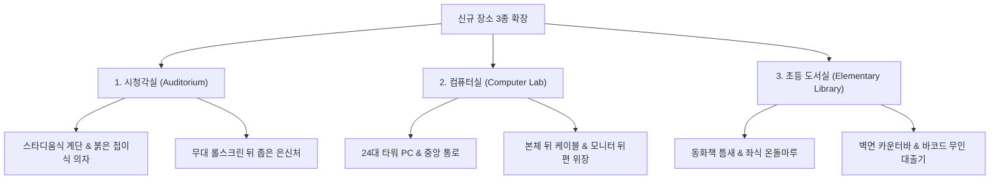

# 신규 장소 3종 레벨 디자인 및 구현 기술 명세서 (Interim Report #03)

- **문서 번호**: IR-20260923-NEW-MAPS-SPEC-01
- **프로젝트 명**: 교실 대소동: 사라진 지우개 찾기 ver2.0 (`eraser_hideandseek`)
- **작성 일자**: 2026년 9월 23일
- **책임자**: Lead Scientist & Technical Owner
- **상태**: 신규 장소 컨셉 확정 및 3D 레벨 디자인 기술 명세 완료 (Ready for Map Implementation)
- **연관 산출물**:
  - 수치 연산 스크립트: [`scripts/93_calculate_new_maps_spec.py`](file:///D:/Projects/eraser_hideandseek/scripts/93_calculate_new_maps_spec.py)
  - 명세 데이터: [`intermediate_results/new_maps_specification.json`](file:///D:/Projects/eraser_hideandseek/intermediate_results/new_maps_specification.json)
  - 기존 맵 시스템: [`index.html#L2053-L2065`](file:///D:/Projects/eraser_hideandseek/index.html#L2053-L2065)

---

## 1. 개요 및 기획 의도

사용자 피드백을 기반으로 학교 현장의 친숙하고 입체적인 공간 3종을 선정하여, 게임의 공간감과 숨바꼭질의 스릴을 극대화할 수 있는 레벨 디자인 명세를 구축하였습니다.



---

## 2. 장소별 3D 공간 및 레벨 디자인 세부 명세

### 🎬 장소 1: 시청각실 (Audio-Visual Room, `av_room`)
- **컨셉**: 대형 화면과 간이 무대, 계단식 좌석이 펼쳐진 어두운 극장형 교육 공간.

```
[평면 및 입면 구조]
┌──────────────────────────────────────────────────────────┐
│  [방음문 1]          [간이 무대 (나무색)]         [방음문 2] │
│                      ┌─────────────────┐                 │
│                      │ 롤스크린        │ (스크린 뒤 은신)│
│  ────────────────────┴─────────────────┴───────────────  │
│                                                          │
│     [1열 접이식 의자 (붉은벽돌색)]  (바닥 y=0)           │
│    ══════════════════════════════════════════════ [단차 1]│
│     [2열 접이식 의자]             (바닥 y=1.5)           │
│    ══════════════════════════════════════════════ [단차 2]│
│     [3열 접이식 의자]             (바닥 y=3.0)           │
│    ══════════════════════════════════════════════ [단차 3]│
│     [4열 접이식 의자]             (바닥 y=4.5)           │
│    ══════════════════════════════════════════════ [단차 4]│
│     [5열 접이식 의자]             (바닥 y=6.0)           │
│    ══════════════════════════════════════════════ [단차 5]│
│     [6열 접이식 의자]             (바닥 y=7.5)           │
│                      [천장 빔프로젝터]                    │
└──────────────────────────────────────────────────────────┘
```

1. **간이 무대 & 스크린 은신처**:
   - 무대 크기: 가로 70 × 세로 25 × 높이 2.2 유닛 (원목 나뭇결 텍스처).
   - 무대 위 전면 벽에 대형 롤스크린(가로 55 × 높이 20)이 설치되며, **스크린과 벽면 사이에 1.8 유닛 깊이의 은신 틈새**를 배치하여 지우개가 누워 숨을 수 있는 특수 명당 제공.
2. **스타디움식 계단형 바닥 (Tiered Seating)**:
   - 앞에서 뒤로 갈수록 6단계에 걸쳐 1.5 유닛씩 높아지는 계단식 단차 바닥.
   - 이동 시 점프 또는 계단 스텝 충돌체로 부드럽게 층계를 오르내릴 수 있음.
3. **붉은 벽돌색 접이식 극장 의자**:
   - 총 60석 (열당 10석 × 6열).
   - 등받이는 직립형, 착석부는 위로 젖혀져 접힌 형태(일어선 상태)로 모델링.
   - 접힌 좌석 쿠션과 등받이 사이의 틈새, 의자 다리 철제 프레임 밑이 최고의 위장 포인트.
4. **흡음재 벽면 & 방음문 & 빔프로젝터**:
   - 벽면: 펀칭 타공 흡음재 텍스처(라이트 그레이/베이지).
   - 문: 무대 양옆에 위치한 육중한 이중 방음문 2개.
   - 천장: 공중에 매달린 빔프로젝터에서 무대 스크린을 향해 은은한 조명 볼륨 연출.

---

### 🖥️ 장소 2: 컴퓨터실 (Computer Lab, `computer_lab`)

> **추가 설계 기록 (2026-09-23)**: 학생용 모니터 24대는 `켜짐 18대 + 절전 3대 + 꺼짐 3대`로 구성한다. 켜진 화면은 코딩, 한글 문서, 그림판, 교육용 게임, 인터넷 학습 페이지, 바탕화면의 6종 Canvas 텍스처를 공유해 반복감을 줄인다. 실제 광원 24개 대신 emissive 재질을 사용하며, 동적 효과는 최대 2~3대의 느린 화면 전환 또는 커서 깜빡임으로 제한한다. 밝은 화면은 역광 노출 단서, 꺼진 화면은 검은색 위장의 고위험·고보상 은신처로 활용한다. 현재 반복 재빌드 시 일부 PC 메쉬가 사라지는 프리뷰 결함을 먼저 수정한 뒤 적용·검증한다.
- **컨셉**: 24대의 데스크톱 컴퓨터가 질서정연하게 정면을 응시하는 정밀 정보교육 공간.

```
[배치 구조]
┌────────────────────────────────────────────────────────┐
│     [대형 전면 스크린]        [교사용 데스크 / 교탁]   │
│                                                        │
│   [좌측 12석 (3행×4열)]   <중앙 통로>   [우측 12석]    │
│   ┌───┬───┬───┬───┐     (폭 18)     ┌───┬───┬───┬───┐ │
│   │PC │PC │PC │PC │                 │PC │PC │PC │PC │ │
│   └───┴───┴───┴───┘                 └───┴───┴───┴───┘ │
│   ┌───┬───┬───┬───┐                 ┌───┬───┬───┬───┐ │
│   │PC │PC │PC │PC │                 │PC │PC │PC │PC │ │
│   └───┴───┴───┴───┘                 └───┴───┴───┴───┘ │
│   ┌───┬───┬───┬───┐                 ┌───┬───┬───┬───┐ │
│   │PC │PC │PC │PC │                 │PC │PC │PC │PC │ │
│   └───┴───┴───┴───┘                 └───┴───┴───┴───┘ │
└────────────────────────────────────────────────────────┘
```

1. **중앙 통로형 24석 배치**:
   - 중앙에 폭 18 유닛의 시원한 주 통로 확보 (술래의 빠른 이동 및 요정의 시야 확보).
   - 좌측 12석(3열 4행), 우측 12석(3열 4행)으로 일목요연한 배열.
2. **세부 가구 및 하드웨어 구성**:
   - **갈색 컴퓨터 책상**: 깊이감 있는 멜라민 목재 갈색 상판.
   - **모니터**: 책상 위 16:9 슬림 베젤 블랙 모니터 (화면에 푸른 코딩 에디터 화면 또는 윈도우 바탕화면 발광).
   - **타워형 본체**: 책상 아래 전용 타워 거치대에 수직 배치.
   - **키보드 & 마우스**: 책상 위 블랙 키보드와 청색 마우스패드.
   - **의자**: 높낮이 조절 레버가 달린 블랙 사무용 바퀴 의자.
3. **은신 및 스포이드 전략**:
   - 모니터 스탠드 뒤편의 사각지대 위장.
   - 책상 아래 어두운 타워 본체 옆면/뒷면 배선 케이블 뭉치 틈새.
   - 키보드 위 블랙 키캡 사이에 네모나게 누워 자판 행세.

---

### 📖 장소 3: 초등학교 도서실 확장/리뉴얼 (`library_elementary`)
- **컨셉**: 딱딱한 도서관을 벗어나 초등학생들의 눈높이에 맞춘 다채롭고 포근한 복합 독서 공간.

```
[구역 구성]
┌────────────────────────────────────────────────────────┐
│  [무인 대출/반납기 1, 2]         [사서 데스크]         │
│                                                        │
│  ┌──────────────────┐            ┌──────────────────┐  │
│  │ 알록달록 낮은    │            │ [온돌 좌식 존]   │  │
│  │ 동화책 서가 A, B │            │ 원형 탁자 & 방석 │  │
│  │ (틈새 은신처)    │            └──────────────────┘  │
│  └──────────────────┘                                  │
│                                  ┌──────────────────┐  │
│  ┌──────────────────┐            │ [일반 열람 테이블│  │
│  │ 그림책 서가 C, D │            │ & 목재 의자들]   │  │
│  └──────────────────┘            └──────────────────┘  │
│                                                        │
│ ═════════════════════════════════════════════════════  │
│  [창가/벽면을 바라보는 1인 카운터 바 테이블 (하이체어)]│
└────────────────────────────────────────────────────────┘
```

1. **다양한 판형의 알록달록 동화책 서가**:
   - 높고 어두운 책장 대신, 초등학생 키높이에 맞춘 낮고 산뜻한 서가(높이 2.8~3.2).
   - 빨강, 주황, 노랑, 청록, 보라 등 원색의 다채로운 책등(Book Spines).
   - **책꽂이 틈새 은신처**: 책이 몇 권 빠져 있는 빈 슬롯을 알고리즘으로 배치하여 지우개가 세로로 쏙 들어가 책등처럼 위장.
2. **3대 다채로운 열람 공간**:
   - **포근한 좌식 공간**: 0.5 유닛 높이의 원목 온돌 마루, 둥근 낮은 탁자, 알록달록 푹신한 쿠션/방석.
   - **표준 열람석**: 친구들과 마주 보고 책을 읽는 표준 목재 테이블 4세트.
   - **벽면/창가 카운터 바(Counter Bar)**: 벽이나 창가를 정면으로 바라보는 긴 바 테이블과 높은 다리 의자(High Chair).
3. **무인 책 대여/반납기 키오스크 (Self-Checkout Kiosk)**:
   - 입구 쪽에 배치된 민트/화이트 색상의 스마트 대출기 2대.
   - 빨간색 바코드 스캐너 빔 레이저 라인 텍스처 표시.
   - 영수증 출력구 및 도서 반납 투입구 틈새가 지우개의 은신처로 기능.

---

## 3. 스포이드 색상 팔레트 및 밸런스 비교

| 맵 구분 | 주요 스포이드 색상 및 텍스처 | 지우개 요정 은신 난이도 | 술래 수색 난이도 | 핵심 시각 테마 |
| :--- | :--- | :--- | :--- | :--- |
| **시청각실** | 붉은 벽돌색(의자), 원목갈색(무대), 라이트그레이(흡음벽), 스크린아이보리 | ★★★★☆ (의자 틈새, 스크린 뒤) | ★★★★☆ (어두운 조명, 계단 높낮이) | 레트로 극장 감성 |
| **컴퓨터실** | 책상갈색, 모니터블랙, 본체차콜, 마우스패드블루, 키보드다크그레이 | ★★★☆☆ (본체 밑, 모니터 뒤) | ★★★☆☆ (중앙 통로로 시야 개방) | 정돈된 IT 교실 감성 |
| **초등 도서실** | 원색동화책(빨강/노랑/청록), 온돌마루베이지, 쿠션핑크, 무인기민트 | ★★★★★ (책 틈새, 쿠션 속) | ★★★★☆ (다양한 눈높이 가구) | 포근한 파스텔 동화 감성 |

---

## 4. 향후 시스템 통합 가이드라인 (Implementation Roadmap)

1. **`index.html` 내 맵 레지스트리(`MAPS`) 확장 등록**:
   ```javascript
   MAPS.av_room = { id: "av_room", name: "시청각실", icon: "🎬", type: "canvas", build: buildAudioVisualRoom };
   MAPS.computer_lab = { id: "computer_lab", name: "컴퓨터실", icon: "🖥️", type: "canvas", build: buildComputerLab };
   MAPS.library_elem = { id: "library_elem", name: "도서실(리뉴얼)", icon: "📖", type: "canvas", build: buildElemLibrary };
   ```
2. **절차적 텍스처(Procedural Textures) 캐싱**:
   - `buildTextures()`에 펀칭 흡음재 패널(`texAcoustic`), 붉은 극장 패브릭(`texTheaterFabric`), 컴퓨터 모니터 UI(`texMonitorScreen`), 바코드 스캐너(`texBarcodeKiosk`) 캔버스 텍스처 추가.
3. **충돌체 및 성능 최적화**:
   - 단일 파일 Zero-Asset 정책에 부합하도록 저사양 크롬북/아이패드에서도 60fps를 유지할 수 있는 지오메트리 인스턴싱 또는 결합(Merge) 기법 채택.

---
본 명세서는 [`interim_reports/03_new_map_ideas_and_level_design_spec.md`](file:///D:/Projects/eraser_hideandseek/interim_reports/03_new_map_ideas_and_level_design_spec.md)로 영구 보존됩니다.
